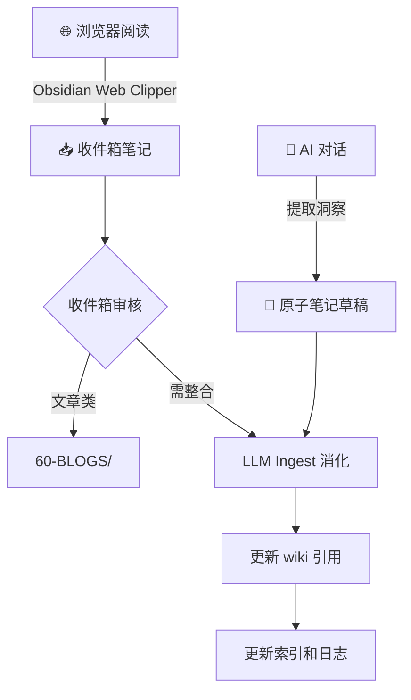

## SOP：知识获取工作流

> 覆盖两种知识获取模式：浏览器的被动剪藏和 AI 对话的主动创作，统一纳入知识库

目标：任何来源的知识都能快速、一致地进入知识库，不堆积、不遗漏
实现：按来源分流，统一经过「捕获 → 加工 → 入库」三阶段

---

### 适用场景

- **模式 A — 浏览器剪藏**：阅读网页/文章/文档时发现有价值内容，需要快速保存到知识库
- **模式 B — AI 对话创作**：与 AI 深入探讨某个领域后，对话中产生了可记录的洞察，需要沉淀为笔记
- 两种模式共享同一套加工和入库标准

---

### 流程图解



---

### 核心步骤

#### 模式 A：浏览器剪藏

1. **捕获** — 使用 Obsidian Web Clipper 将网页保存为 markdown 到 Inbox
2. **审核** — 运行 inbox-review，判断内容类型
	 - 文章/博客 → `60-BLOGS/`
	 - 可消化知识 → 进入 ingest
3. **消化** — 运行 `llm-wiki-local ingest`，将内容整合到 concept/SOP/MOC 等 Wiki 层笔记
4. **入库** — wiki-sync 更新 wiki-index 和 wiki-log

#### 模式 B：AI 对话创作

1. **提取** — 对话结束时，让 AI 总结本次对话的核心发现，每条写成一个 atomic 笔记
2. **关联** — 检查对话涉及哪些现有的 concept/SOP/MOC，更新其内容或引用
3. **入库** — 记录 wiki-log，标记本次对话产出

---

### 实践示例

**模式 A 示例**：读到一篇关于 React 性能优化的文章

```bash
Web Clipper 剪藏 → Inbox → inbox-review 判断为文章 → 60-BLOGS/
                                      → 有价值知识点 → ingest → 更新 SOP-React性能优化
```

**模式 B 示例**：与 AI 讨论状态管理方案

```bash
对话结束 → "总结本次对话的关键发现" → 产出 2 条 atomic 笔记
         → 更新 Zustand vs Redux 对比 → 记入 wiki-log
```

### 常见坑点

- ⛔ **模式 A 堆积**：剪藏太多不审核，inbox 膨胀
	- 🔧 排查：定期 inbox-review，每周至少清理一次
- ⛔ **模式 B 流失**：对话产生了好洞察但不记录，等同于没发生过
	- 🔧 排查：对话结束务必执行收尾三步（提取 → 关联 → 入库）

---

### 知识图谱

- **相关概念**：
	- [[知识获取]] — 知识获取 MOC 入口
	- [[A-知识管理]] — 知识管理领域
	- [[SOP-CODE知识全生命周期工作流]] — 完整知识管理流程
	- [[SOP-AI提问技巧]] — AI 提问方法论
- **相关原子笔记**：
	- [[AI提问质量取决于上下文结构化程度]] — 结构化上下文决定回答质量
