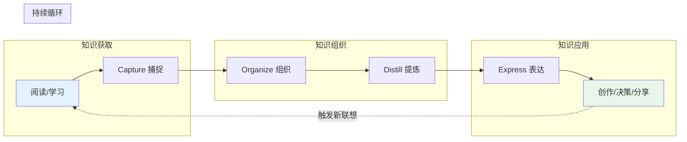

## 概念：第二大脑

> 第二大脑是用数字工具构建的个人知识管理系统，通过外部存储补充人脑记忆，辅助思考和决策。

**解决的核心痛点**：人脑记忆有限且易遗忘——需要外部系统存储和组织知识，释放认知负荷

---

### 核心命题

- [[外部大脑能释放前额叶的认知负荷]]
	- 工作记忆容量有限，将知识外包给数字系统
- [[知识只有被调用时才产生价值]]
	- 反对收藏癖，强调检索和应用
- [[自下而上的涌现优于自上而下的分类]]
	- 双向链接和原子笔记的必要性

---

### 运行机制

[[CODE知识全生命周期工作流]]：
- **Capture**：快速捕捉想法和信息
- **Organize**：按 PARA 分类组织
- **Distill**：提炼核心观点
- **Express**：输出和应用知识

---

### 关键区别

| 维度 | 第二大脑 | [[数字花园]] | 博客 |
|:--- |:--- |:--- |:--- |
| **核心目的** | 辅助思考和记忆 | 公开分享和生长 | 内容发布 |
| **范围** | 主要是私有 | 半公开 | 完全公开 |
| **强调** | 存储与检索 | 生长与迭代 | 输出与传播 |
| **知识单元** | 原子化，散射状 | 树形延申 | 主题文章 |

---

### 应用场景

- ✅ **适用场景**
	- **知识积累**：长期构建个人知识库
	- **辅助决策**：快速检索相关信息
	- **写作创作**：通过链接激发新想法
- ⛔ **误用**
	- **收藏癖**：只存不用，虚假满足感
	- **过度整理**：花太多时间在分类而非思考

---

### 知识图谱

- **父级概念**：[[A-知识管理]]
- **并列概念**：[[数字花园]]
- **相关概念**：[[PARA笔记法]], [[卡片盒笔记法]], [[有意义学习]]

---

### 参考延伸

- **来源**：Tiago Forte 提出 PARA 方法
- **核心工具**：Obsidian、Notion、Roam Research
- **理论基础**：认知心理学（工作记忆、认知负荷）
