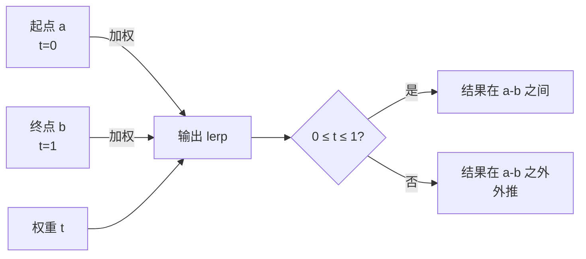

## 概念：线性插值

> 在两个离散点之间，按线性比例估算中间值的方法

**解决的核心痛点**：连续变化的数据在离散采样点之间如何估算真实值？线性插值提供了一种简单、高效的估算方法，是计算机图形学、游戏动画、数据分析等领域的基础工具。

---

### 核心命题

> 核心命题引用 atomic 笔记（陈述句观点），每个命题是一句话洞见

- 线性插值的本质是**加权平均** — 当权重 t 从 0 变到 1 时，输出从起点平滑过渡到终点
	- **原理**：`lerp(a, b, t) = a + (b - a) * t`，当 t=0 时返回 a，t=1 时返回 b
- 线性插值假设数据在两点之间**均匀变化** — 这个假设在短距离内近似成立
	- **原理**：自然界中大多数连续变化可以局部线性近似
- 线性插值是其他插值方法的基础 — 二次插值、三次插值等都是在线性插值上的扩展
	- **原理**：`lerp` 是 `smoothstep`、`cubic` 等高级插值的构建模块

---

### 运行机制

线性插值在两个端点之间按比例计算中间值：

**数学定义**：

$$
\text{lerp}(a, b, t) = a + (b - a) \cdot t = (1-t)a + tb
$$

| 参数  | 含义      | 范围                   |
|:-- |:------ |:------------------- |
| a   | 起点值     | 任意实数                 |
| b   | 终点值     | 任意实数                 |
| t   | 权重/插值因子 | [0, 1] 插值，<0 或 >1 外推 |
| 返回值 | 插值结果    | a 到 b 之间             |

---

### 关键区别

| 维度 | 线性插值 | 二次插值 | 三次插值 |
|:--- |:--- |:--- |:--- |
| **复杂度** | O(1) | O(n²) | O(n³) |
| **连续性** | C⁰：位置连续 | C¹：切线连续 | C²：曲率连续 |
| **精度** | 低 | 中 | 高 |
| **典型问题** | 棱角分明 | 尖点消失 | 速度平滑 |

**连续性说明**：
- **C⁰**：位置连续，但存在角点（方向突变）
- **C¹**：切线连续，角点变平滑（尖点消失）
- **C²**：曲率连续，速度变化也平滑

---

### 应用场景

- ✅ **适用场景**
	- **游戏动画**：角色移动、相机过渡 — lerp 广泛用于平滑过渡
	- **颜色渐变**：UI 配色、粒子颜色 — 简单高效的渐变混合
	- **数值动画**：血条变化、进度条 — 线性变化给用户即时反馈
	- **图形渲染**：纹理坐标计算 — bilinear filtering 的基础
	- **数据估算**：已知两点坐标，估算中间值 — 简单预测
- ⛔ **误用**
	- **高精度曲线**：线性插值会产生棱角分明的过渡，高精度需求用三次样条
	- **非均匀分布数据**：数据本身非线性时，线性插值误差大

---

### SOP

> 注意：线性插值领域暂无标准化操作流程 (SOP) 笔记

---

### 知识图谱

> 知识图谱链接 term（术语定义）和相关 concept，建立概念关系网络

- **父级概念**：
	- [[计算机图形学]] — 渲染管线中大量使用插值计算
	- [[数学]] — 数值分析的基础方法
- **子级概念**：
	- [[双线性插值]] — 二维网格上的线性插值扩展
	- [[平滑步进]] — 基于 lerp 的平滑过渡函数
- **并列概念**：
	- [[样条插值]] — 通过控制点的高阶多项式插值
	- [[最近邻插值]] — 取最近的已知点，不做平均
- **相关概念**：
	- [[光栅化]] — 几何图元光栅化过程中大量使用插值
	- [[贝塞尔曲线]] — 用控制点定义的光滑曲线
- **参考文章**
	- Scratchapixel - Linear Interpolation
	- Wikipedia - Linear Interpolation

---

### FAQ

> 与本概念相关的开放性问题，待进一步探索

- [[Q-何时用线性插值vs三次插值]]
- [[Q-双线性插值和双三次插值的区别]]
