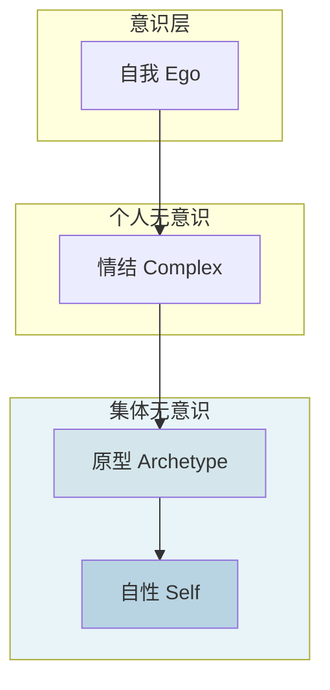

## 概念：荣格心理学

> 荣格心理学（分析心理学）是由卡尔·荣格创立的精神分析流派，关注人类心灵的深层结构——集体无意识，以及个体的自我实现之路。

**解决的核心痛点**：弗洛伊德精神分析过于强调性驱力和童年经历，忽视了人的精神追求、灵性面向和未来导向的成长可能性。

---

### 核心命题

> 核心命题引用 atomic 笔记（陈述句观点），每个命题是一句话洞见

- [[集体无意识是人类共有的深层心理基础]]
	- **原理**：集体无意识不是个体后天获得的，而是人类世代进化中积淀的先天心理结构，包含着人类共同的原始意象
- [[原型是集体无意识中的原始意象]]
	- **原理**：原型是心灵的原始模式，如 " 母亲原型 "、" 英雄原型 "、" 阴影原型 " 等，影响着人的行为和梦境
- [[个体化是终身的自我实现过程]]
	- **原理**：个体化的目标是整合意识与无意识，达成自性（Self）的完整，实现人格的统合

---

### 运行机制

荣格心理学的人格结构模型：

**个体化进程**是个体将无意识内容（特别是阴影）整合到意识中的过程，最终目标是达成自性的完整。

---

### 关键区别

| 维度 | 荣格心理学 | 弗洛伊德精神分析 |
|:--- |:--- |:--- |
| **Libido 概念** | 心灵能量/精神生命驱力 | 性驱力 |
| **无意识结构** | 个人无意识 + 集体无意识 | 仅个人无意识 |
| **儿童性欲** | 不强调 | 核心地位 |
| **宗教与灵性** | 接纳，甚至重视 | 视为幻觉 |
| **治疗目标** | 个体化，人格整合 | 症状缓解 |
| **对梦的态度** | 通往无意识的桥梁 | 伪装满足 |

---

### 应用场景

- ✅ **自我探索**：通过积极想象、梦的分析认识无意识内容
- ✅ **人格类型理解**：MBTI 人格测试的理论基础（虽简化了原著）
- ✅ **文学批评**：原型批评理论，影响《千面英雄》等作品
- ✅ **个人成长**：理解阴影、整合人格的实践框架
- ⛔ **心理治疗**：严重心理疾病需专业治疗，不宜仅靠自学

---

### 核心概念图谱

| 概念 | 说明 |
|:---|:---|
| **集体无意识** | 人类共有的、超个人的深层心理基础 |
| **原型** | 集体无意识中的原始意象（母亲、英雄、阴影、阿尼玛/阿尼姆斯等） |
| **阴影** | 人格中被压抑、被否认的部分 |
| **阿尼玛/阿尼姆斯** | 集体无意识中的男性/女性意象 |
| **自性** | 人格的整体性核心，个体化的目标 |
| **个体化** | 整合意识与无意识，终身的自我实现过程 |
| **积极想象** | 与无意识对话的技术 |
| **外倾/内倾** | 人格倾向的基本类型 |
| **思维/情感/感觉/直觉** | 心理功能类型 |

---

### 知识图谱

- **父级概念**：[[A-心理学]] — 心理学的上位领域
- **并列概念**：
	- [[弗洛伊德精神分析]] — 精神分析的另一流派
	- [[认知心理学]] — 心理学另一重要分支
	- [[存在主义]] — 关注存在意义的相关哲学/心理学流派
- **相关概念**：
	- [[C-MBTI]] — 人格类型理论（简化自荣格）
	- [[C-原型理论]] — 文学批评中的荣格概念应用
- **参考资源**：
	- 《心理类型》— 荣格
	- 《红书》— 荣格
	- 《英雄之旅》— 约瑟夫·坎贝尔
