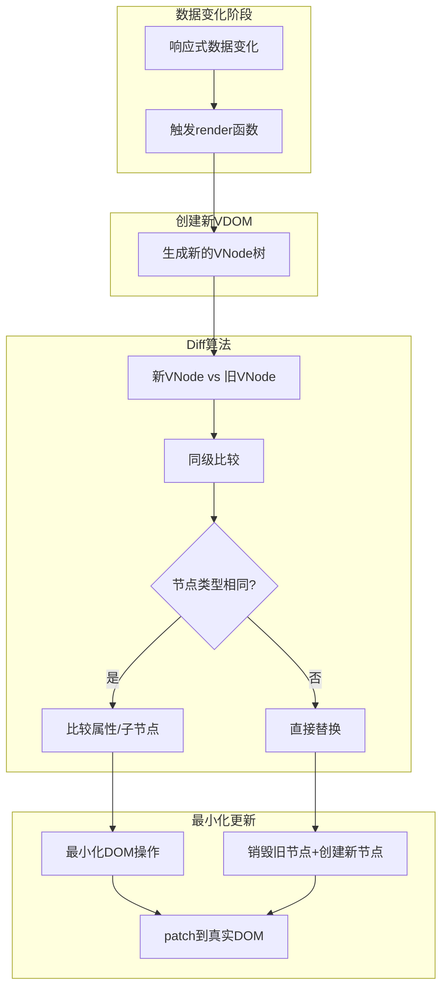

## 概念：虚拟 DOM

> 虚拟 DOM（Virtual DOM）是用 JavaScript 对象模拟真实 DOM 结构的编程技术，是现代前端框架实现高效 DOM 更新的核心机制。

**解决的核心痛点**：直接操作真实 DOM 性能开销大，虚拟 DOM 通过批量更新和差异对比最小化 DOM 操作次数

---

### 核心命题

- **虚拟 DOM 的本质**
	- 本质：一个 JavaScript 对象树，节点称为 "VNode"（虚拟节点）
	- 每个 VNode 包含：标签名、属性、子节点、事件处理等信息
- **Vue 中的实现**
	- Vue2：使用 `vnodes` 对象树
	- Vue3：使用更强的类型系统（VNode TS 类型）

---

### 运行机制



#### 1. VNode 结构

```javascript
// 简化版VNode结构
const vnode = {
  type: 'div',           // 标签类型
  props: {               // 属性
    id: 'app',
    class: 'container',
    onClick: handleClick
  },
  children: [           // 子节点
    { type: 'span', children: 'Hello' },
    { type: 'button', children: 'Click' }
  ],
  el: null              // 对应的真实DOM引用
}
```

#### 2. Diff 算法核心

**同层级比较（O(n) 复杂度）**：
- 只比较同层级的节点，不同层级不移动
- key 的作用：帮助 Diff 算法识别相同节点，避免不必要的重渲染

**优化策略**：
- 首尾指针法：双向遍历减少比较次数
- 静态节点标记：跳过不需要更新的节点

---

### 关键区别

| 维度 | 虚拟 DOM | 直接操作 DOM |
|:---|:---|:---|
| **性能** | 批量更新，最小化操作 | 每次修改都触发重排 |
| **可预测性** | 数据驱动，结果可预测 | 依赖操作顺序 |
| **跨平台** | 可渲染到不同平台 | 仅限浏览器 |

---

### 应用场景

- **适用场景**
	- 数据驱动视图的 SPA 应用
	- 频繁更新 DOM 的场景
	- 需要抽象层支持 SSR/小程序
- **误用**
	- 静态页面（无需频繁更新）
	- 简单场景下过度使用框架

---

### 知识图谱

- **父级概念**：[[前端开发]]
- **子级概念**：
	- [[Diff算法(Vue3)]]
- **关联概念**：
	- [[响应式原理(Vue3)]] — 触发 VNode 重新生成的源头
	- [[模板编译(Vue3)]] — 模板如何转换为 render 函数
- **相关问题**：
	- Vue3 比 Vue2 的 VDOM 更快吗

---

### 参考延伸

- Vue 官方文档：Virtual DOM
- 源码文件：`packages/runtime-core/src/vnode.ts`
