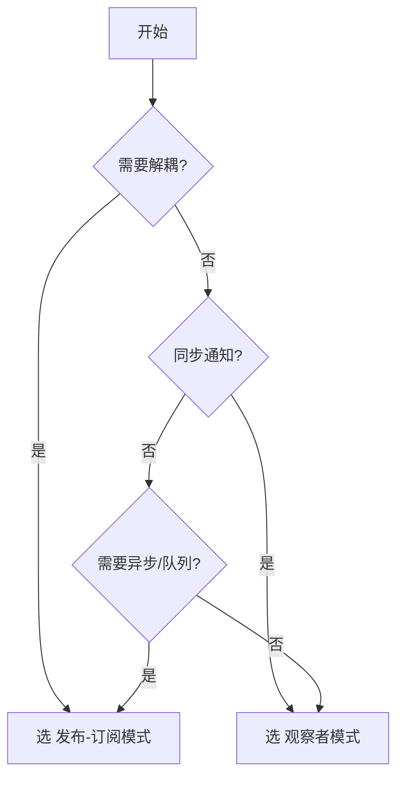

## 观察者模式 vs 发布订阅模式

### 🔰 一句话对比

==观察者模式是发布订阅模式的基础，区别在于耦合程度——观察者模式中 Subject 与 Observer 直接通信，而发布订阅模式通过中间的消息代理实现完全解耦。==

---

### 🧠 对比全景图

#### 各自定义

| 维度         | **观察者模式**                     | **发布订阅模式**                            |
|:--------- |:---------------------------- |:------------------------------------ |
| **一句话定义**  | 对象间的一对多依赖关系，当对象状态变化时自动通知所有观察者 | 通过消息代理实现发布者和订阅者的间接通信，实现解耦             |
| **核心本质**   | Subject 直接持有 Observer 引用      | Publisher 和 Subscriber 通过 Broker 间接通信 |
| **解决什么问题** | 对象间同步状态变化                     | 降低发布者和订阅者之间的耦合度                       |

#### 核心对比维度

| 对比维度                    | **观察者模式**                 | **发布订阅模式**    | 我的理解           |
|:---------------------- |:------------------------ |:------------ |:------------- |
| **耦合程度**                | 高（直接引用）                   | 低（通过代理）       | 解耦更彻底          |
| **通信方式**                | 直接通信                      | 间接通信          | 中间层增加灵活性       |
| **Subject/Publisher**   | 知道所有 Observer             | 不知道订阅者        | 隐私性更好          |
| **Observer/Subscriber** | 知道 Subject                | 不知道 Publisher | 无依赖            |
| **消息传递**                | 同步/直接                     | 可异步           | Pub/Sub 支持消息队列 |
| **扩展性**                 | 差（修改 Subject 要改 Observer） | 好（可动态添加订阅）    | 更适合复杂系统        |
| **适用场景**                | 紧密耦合的业务                   | 分布式/事件驱动系统    | 按需选择           |

#### 相似之处

- 都实现了事件驱动的通信机制
- 都能实现一对多的消息通知
- 都遵循 " 生产者 - 消费者 " 的逻辑
- 都支持观察者/订阅者的动态注册

#### 核心区别（一句话总结）

观察者模式是**同步的直接通信**，发布 - 订阅模式是**可异步的间接通信**，后者通过消息代理实现更松散的耦合。

---

### 💻 代码/实例对比

#### 观察者模式示例

```javascript
// Subject（被观察者）
class Subject {
  constructor() {
    this.observers = [];
  }

  addObserver(observer) {
    this.observers.push(observer);
  }

  removeObserver(observer) {
    this.observers = this.observers.filter(o => o !== observer);
  }

  notify(data) {
    this.observers.forEach(observer => observer.update(data));
  }
}

// Observer（观察者）
class Observer {
  update(data) {
    console.log("Observer received:", data);
  }
}

// 使用
const subject = new Subject();
const observer1 = new Observer();
const observer2 = new Observer();

subject.addObserver(observer1);
subject.addObserver(observer2);
subject.notify("Hello"); // 直接通知所有观察者
```

#### 发布 - 订阅模式示例

```javascript
// 消息代理（Broker）
class Broker {
  constructor() {
    this.topics = {};
  }

  subscribe(topic, callback) {
    if (!this.topics[topic]) {
      this.topics[topic] = [];
    }
    this.topics[topic].push(callback);
  }

  publish(topic, data) {
    if (this.topics[topic]) {
      this.topics[topic].forEach(callback => callback(data));
    }
  }
}

// 使用
const broker = new Broker();

broker.subscribe("event1", data => console.log("Subscriber 1:", data));
broker.subscribe("event1", data => console.log("Subscriber 2:", data));

broker.publish("event1", "Hello"); // 通过代理传递
// Publisher 不知道有多少订阅者
```

---

### 场景选择指南

- **选观察者模式当**：
	- 对象之间存在强耦合关系
	- 需要同步状态变化
	- Subject 数量少且稳定
	- 如：Vue 响应式系统、DOM 事件监听
- **选发布 - 订阅模式当**：
	- 需要解耦的系统
	- 发布者和订阅者数量不确定
	- 需要异步处理或消息队列
	- 如：EventBus、Redux/Middleware、消息队列系统

---

## 🗺️ 决策树



---

## 🔗 关联网络

- **父级话题**：[[前端]], [[设计模式]]
- **相关概念**：
	- [[观察者模式]]
	- [[发布订阅模式]]
	- [[EventBus]]
	- [[Vue3-响应式系统原理]]

---

## 📝 元数据与思考

- **对比类型**：演进关系（观察者是基础，发布订阅是扩展）
- **信息来源**：设计模式经典著作 + 前端框架实践
- **可信度**：高
- **验证状态**：理论理解 + 实际应用

### 💭 我的思考

- **最初困惑**：两个模式看起来很像，区别在哪里？
- **现在理解**：关键看有没有 " 中间人 "——有 Broker 就是 Pub/Sub，没有就是 Observer
- **实际应用场景**：Vue3 的响应式更接近 Observer，而 EventBus 更像 Pub/Sub

### ✅ 下一步行动

- 在项目中识别并应用合适的模式
- 分析 Vue 源码中的响应式实现
- 了解发布订阅在消息队列中的应用
