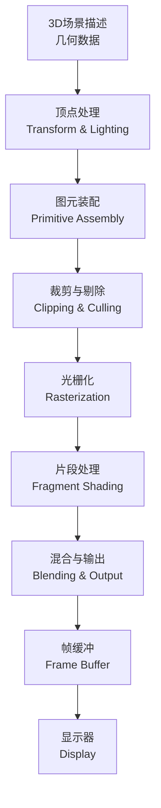

## 概念：计算机图形学

> 研究如何在计算机中表示、生成、处理和显示图形的一门学科

**解决的核心痛点**：人类视觉理解远早于文字，图形是人类最自然的 信息表达方式。计算机图形学让人机交互从冰冷的文字走向直观的可视化， 使抽象数据和复杂场景能够以图像的形式被理解和探索。

---

### 核心命题

> 核心命题引用 atomic 笔记（陈述句观点），每个命题是一句话洞见

- [[图形是信息的超集]] — 图形可以包含文字、照片、图表等一切视觉元素
	- **原理**：研究表明人类处理图像的速度远快于文字
- [[渲染管线是图形学的核心]] — 3D 场景最终必须转化为 2D 图像才能显示
	- **原理**：从几何数据到像素颜色的转换过程
- [[光栅化是实时渲染的主流方法]] — 现代 GPU 基于光栅化实现高性能图形
	- **原理**：将 3D 图元离散化为 2D 像素片段

---

### 运行机制

计算机图形学的核心流程是从 **3D 场景描述** 到 **2D 图像** 的转换：

**渲染管线的主要阶段**：

| 阶段 | 输入 | 输出 | 说明 |
|:---|:---|:---|:---|
| 顶点处理 | 顶点数据 | 变换后的顶点 | MVP 变换、光照计算 |
| 图元装配 | 顶点 | 图元 | 将顶点组装成三角形/线段 |
| 裁剪与剔除 | 图元 | 可见图元 | 视锥剔除、裁剪超出视野的几何 |
| 光栅化 | 图元 | 片段 | 将图元离散化为像素片段 |
| 片段着色 | 片段 | 颜色 | 纹理采样、光照计算 |
| 混合输出 | 片段 | 像素 | 深度测试、透明度混合 |

---

### 关键区别

| 维度 | 计算机图形学 | 计算机视觉 |
|:---|:---|:---|
| **核心逻辑** | 从模型生成图像 | 从图像推断模型 |
| **输入** | 3D 模型、场景描述 | 2D 图像/视频 |
| **输出** | 可显示的图像 | 场景理解、物体识别 |
| **典型任务** | 渲染、动画、仿真 | 目标检测、姿态估计 |
| **应用产品** | 游戏、CAD、电影特效 | 自动驾驶、人脸识别 |

| 维度 | 光栅化 | 光线追踪 |
|:---|:---|:---|
| **核心思想** | 离散化扫描转换 | 模拟光线物理传播 |
| **实时性** | ✅ 适合实时（60fps+） | ❌ 计算量大，通常离线渲染 |
| **光照效果** | 近似 | 物理正确（反射、折射、全局光照） |
| **典型应用** | 游戏、交互应用 | 电影渲染、建筑可视化 |

---

### 应用场景

- ✅ **适用场景**
	- **游戏开发**：实时渲染 60fps，需要 GPU 光栅化优化
	- **电影特效**：离线渲染，追求真实光照效果
	- **CAD/CAE**：工程图纸、有限元可视化
	- **数据可视化**：将抽象数据转化为图表、热力图
	- **虚拟现实/增强现实**：实时图形渲染，低延迟要求
	- **UI/界面设计**：按钮、图标、窗口等 2D 图形绘制
- ⛔ **误用**
	- **用图形学做图像识别**：应该用计算机视觉而非图形学
	- **实时游戏用过量光线追踪**：光栅化仍是主流，混合方案更实用

---

> 注意：计算机图形学领域暂无标准化操作流程 (SOP) 笔记，相关子概念见下方知识图谱

---

### FAQ

> 与本概念相关的开放性问题，待进一步探索

- [[WebGPU会取代WebGL吗]]
- [[实时全局光照有哪些主流方法]]

---

### 知识图谱

> 知识图谱链接 term（术语定义）和相关 concept，建立概念关系网络

- **父级概念**：
	- [[计算机科学]] — 上位学科
- **子级概念**：
	- [[光栅化]] — 将图元离散化为像素的过程
	- [[3D高斯泼溅]] — 基于高斯分布的新型渲染技术
	- [[Mesh]] — 3D 网格表示
	- [[GLSL]] — 着色器编程语言
- **并列概念**：
	- [[计算机视觉]] — 图像到模型的逆过程
	- [[人机交互]] — 以图形界面为核心交互方式
- **相关概念**：
	- [[GPU渲染管线]] — 硬件层面的渲染管线实现
	- [[高斯分布]] — 3D 高斯泼溅的数学基础
- **参考文章**
	- Real-Time Rendering, 4th Edition
	- Scratchapixel 3D Graphics Tutorials
