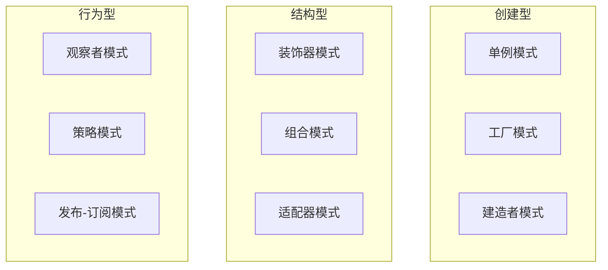

> 设计模式是在软件设计中解决常见问题的可重用解决方案。它们是经过验证的、被广泛接受的最佳实践，可以帮助开发者编写更可维护、可扩展和可重用的代码。

**解决的核心痛点**：如何在软件开发中避免重复造轮子？设计模式提供了经过验证的解决方案，让开发者能够复用前人的经验，而非从零开始解决已知问题。

---

## 核心命题

- [[设计模式是软件设计中可复用的解决方案]]
	- **原理**：设计模式是针对常见软件设计问题的标准化解决方案，经过大量项目验证，具有良好的可维护性和可扩展性
- [[设计模式提升代码质量而非功能]]
	- **原理**：设计模式不添加新功能，而是改进代码的组织方式，提高可读性、可维护性和可测试性

---

## 运行机制

设计模式通常包含三个核心角色：
- **创建型**：关注对象创建机制
- **结构型**：关注对象组合方式
- **行为型**：关注对象间通信

---

## 关键区别

| 维度 | 设计模式 | 算法 |
|:--- |:--- |:--- |
| **目的** | 代码结构优化 | 问题求解 |
| **粒度** | 代码级别 | 数据/计算级别 |
| **复用方式** | 思想/原则 | 具体实现 |
| **上下文依赖** | 强（需判断场景） | 弱（普适） |

---

## 应用场景

- ✅ **适用场景**
	- **代码组织**：需要结构化代码时
	- **团队协作**：统一代码风格和思路
	- **技术传承**：让新手快速理解代码意图
- ⛔ **误用**
	- **过度设计**：简单问题强行用模式
	- **为用而用**：不理解模式适用场景
	- **死记硬背**：不知其原理

---

## 前端常用设计模式

| 模式         | 类型  | 描述             |
|:--------- |:-- |:------------- |
| [[单例模式]]   | 创建型 | 确保一个类只有一个实例    |
| [[观察者模式]]  | 行为型 | 定义对象间的一对多依赖关系  |
| [[发布订阅模式]] | 行为型 | 发布者和订阅者解耦      |
| [[策略模式]]   | 行为型 | 定义一组可互换的算法     |
| [[工厂模式]]   | 创建型 | 创建对象的接口        |
| [[装饰器模式]]  | 结构型 | 动态添加额外职责       |
| [[组合模式]]   | 结构型 | 树形结构表示整体 - 部分  |
| [[模块模式]]   | 创建型 | IIFE 封装私有作用域   |
| [[依赖注入]]   | 创建型 | 将对象需要的依赖改为外部注入 |

---

## 知识图谱

- **父级概念**：[[软件设计]] — 设计模式是软件设计的最佳实践
- **子级概念**：
	- [[单例模式]] — 创建型模式
	- [[观察者模式]] — 行为型模式
	- [[发布订阅模式]] — 行为型模式
	- [[观察者模式 vs 发布订阅模式|观察者 vs 发布订阅]] — 设计模式对比
- **并列概念**：
	- [[重构]]
	- [[代码整洁之道]]
- **相关概念**：
	- [[面向对象编程]]
	- [[SOLID 原则]]

---

## 参考延伸

- 《设计模式：可复用面向对象软件的基础》（Gang of Four）
- [Refactoring Guru](https://refactoring.guru/design-patterns)
