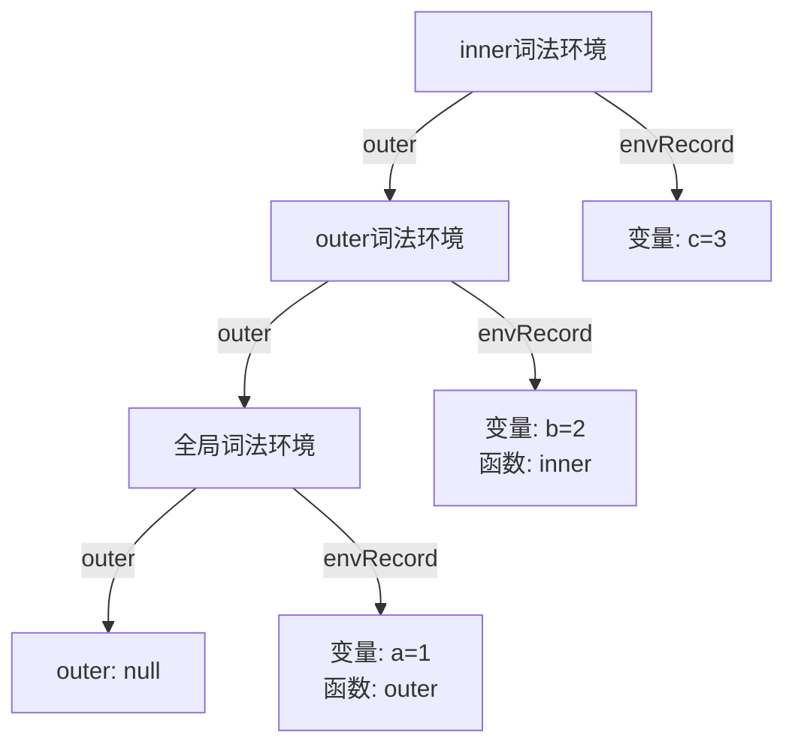

> 词法环境（LexicalEnvironment）是 JavaScript 中用于记录变量和函数声明绑定的数据结构，在代码解析阶段确定，与调用位置无关。

**解决的核心痛点**：如何在代码执行前确定变量的作用域，实现静态（词法）作用域。

---

## 核心命题

- [[词法环境在代码解析阶段就确定了变量的作用域]]
	- **原理**：编译器在解析代码时就确定了变量和函数的绑定，不受运行时影响
- [[词法环境通过 outer 引用形成作用域链]]
	- **原理**：每个词法环境都持有对父级词法环境的引用，形成链式查找结构

---

## 运行机制



1. **代码解析阶段**：扫描代码，创建词法环境
2. **环境记录**：存储变量声明和函数声明
3. **outer 链接**：指向父级词法环境
4. **作用域查找**：从内向外逐层查找变量

### 代码示例

```javascript
const a = 1;  // 全局词法环境

function outer() {
  const b = 2;  // outer 的词法环境

  function inner() {
    const c = 3;  // inner 的词法环境
    console.log(a + b + c);  // 查找顺序：inner → outer → 全局
  }

  inner();
}

outer();  // 输出：6
```

**变量查找过程**：
- 查找 `c`：在 inner 的词法环境找到 → `3`
- 查找 `b`：inner 没有 → 通过 outer 引用在 outer 词法环境找到 → `2`
- 查找 `a`：outer 没有 → 通过 outer 引用在全局词法环境找到 → `1`

---

## 关键区别

> 执行上下文同时包含 LexicalEnvironment 和 VariableEnvironment 两者

| 维度 | 词法环境 | 变量环境 |
|:--- |:--- |:--- |
| **定义** | 记录变量/函数绑定 | 记录 var 声明 |
| **处理** | let/const、函数声明 | var 声明 |
| **绑定方式** | 临时性（TDZ） | 立即可用 |
| **暂时性死区** | 存在（let/const） | 不存在 |

---

## 应用场景

- ✅ **适用场景**
	- **理解闭包原理**：闭包本质是函数记得定义时的词法环境
	- **理解作用域链**：通过 outer 引用查找变量
	- **理解变量提升**：var 声明在变量环境中的特殊处理
- ⛔ **误用**
	- **将动态作用域误认为词法作用域**：JavaScript 是静态作用域

---

## 知识图谱

- **父级概念**：[[执行上下文]] — 词法环境是执行上下文的组成部分
- **子级概念**：
	- [[环境记录]] — 词法环境的核心组件
	- [[外部词法环境引用]] — 形成作用域链的关键
- **并列概念**：
	- [[变量环境]] — 执行上下文的另一组成部分
- **相关概念**：
	- [[作用域链]]
	- [[闭包]]
	- [[变量提升]]

---

## 参考延伸

- ECMAScript 规范：LexicalEnvironment
- 《你不知道的 JavaScript》上卷：作用域和闭包
