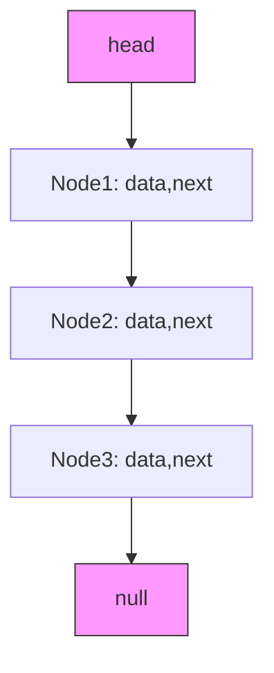

## 概念：链表

> 链表是一种线性数据结构，由一系列节点组成，每个节点包含数据和指向下一个节点的指针。

**解决的核心痛点**：数组在插入和删除时需要移动元素，时间复杂度为 O(n)，链表通过指针直接修改引用即可实现 O(1) 的插入和删除。

---

### 核心命题

- **指针的灵活性**：链表的本质是通过指针而非连续内存来组织数据，这使得节点可以分布在内存的任意位置
- **时间换空间**：链表用更多的内存开销（存储指针）换取操作的时间效率
- **天然的递归结构**：链表节点包含指向下一个节点的指针，本质上是一个递归结构，适合用递归算法处理

---

### 运行机制



**单链表操作**：

```javascript
// 定义节点
class ListNode {
  constructor(val, next = null) {
    this.val = val;
    this.next = null;
  }
}

// 定义链表
const head = new ListNode(1, new ListNode(2, new ListNode(3)))

// 反转链表
function reverseList(head) {
  let prev = null;
  let curr = head;
  while (curr) {
    const next = curr.next;
    curr.next = prev;
    prev = curr;
    curr = next;
  }
  return prev;
}
```

---

### 关键区别

| 维度 | 链表 | 数组 |
|:---|:---|:---|
| **内存分布** | 分散 | 连续 |
| **访问方式** | 遍历 | 随机访问 |
| **插入/删除** | O(1) | O(n) |
| **空间开销** | 额外指针 | 无额外开销 |

---

### 应用场景

- ✅ **适用场景**
	- **频繁增删**：链表在已知位置插入/删除只需 O(1)
	- **动态大小**：无需预分配空间，按需创建
	- **队列实现**：用链表实现队列比数组更高效
- ⛔ **误用**
	- **随机访问多**：链表不支持 O(1) 随机访问，频繁访问应选数组
	- **内存碎片**：频繁创建/销毁节点可能导致内存碎片

---

### 常见题型

| 题型         | 解法要点                                   |
|:--------- |:------------------------------------- |
| [[反转链表]]   | 迭代：prev/curr/next 三指针；递归： head.next 反转 |
| [[环形链表]]   | 快慢指针，相遇则有环                             |
| [[合并有序链表]] | 虚拟头节点 + 迭代比较                           |
| 删除倒数第 N 个  | 快慢指针间隔 N                               |
| 链表相交       | 长度差 + 双指针                              |

---

### 知识图谱

- **父级概念**：[[常用数据结构]]
- **子级概念**：
	- 单链表 — 单向指针
	- 双向链表 — 前后指针
	- 循环链表 — 尾指头
- **并列概念**：[[数组]]
- **相关概念**：[[栈]], [[队列]]

---

### FAQ

- Q: 链表和数组怎么选择？
	- 数组更简单，对性能没有要求的情况下使用，
	- 需要对节点进行频繁操作的情况下使用
- Q: 为什么单向链表需要虚拟头节点？

---

### 参考延伸

- LeetCode 206. 反转链表
- LeetCode 141. 环形链表
- LeetCode 21. 合并两个有序链表
