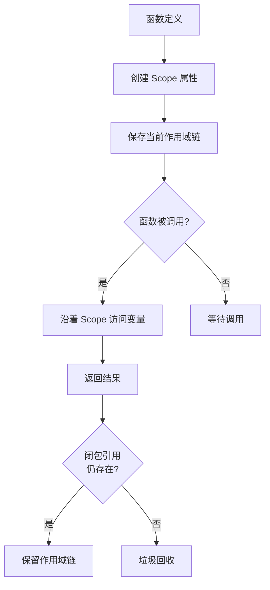
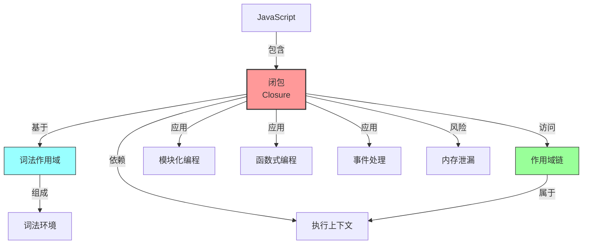

## 核心定义

> 闭包 (Closure) 是函数与其声明时的词法环境的组合。当函数被创建时，它会 " 记住 " 自己定义时的作用域链，即使该函数在调用时已离开原作用域，仍能访问那些变量。

> 闭包的形成只需满足两个条件：
> 1. **函数嵌套**：一个函数内部定义了另一个函数
> 2. **内部函数引用了外部函数的变量**

**解决的核心痛点**：在函数式编程中，需要让函数携带其执行环境，实现数据封装和函数工厂模式。

## 核心命题与原则

- [[闭包的本质是函数保存了其定义时的作用域链]]
	- **原理**：JavaScript 采用词法作用域，函数通过 `[[Scope]]` 属性保存定义时的作用域链
- [[闭包可以创建私有变量]]
	- **原理**：闭包访问的是外部函数的词法环境，而非全局变量，形成私有作用域
- [[闭包会导致内存泄漏]]
	- **原理**：只要闭包函数存在引用，其作用域链就不会被垃圾回收

## 运行机制

### 运作流程

### 关键区别

| 维度       | 闭包          | [[IIFE]]     |
|:------- |:---------- |:----------- |
| **核心逻辑** | 函数记住定义时的作用域 | 函数定义后立即执行并销毁 |
| **生命周期** | 长期存在，保存状态   | 执行后立即销毁      |
| **适用场景** | 数据封装、函数工厂   | 避免污染全局、模块模式  |

## 应用场景与反模式

### 适用场景

- **数据封装**：创建只能通过特定方法访问的私有变量
- **函数工厂**：创建具有不同配置的函数
- **模块模式**：实现模块化的代码组织
- **事件处理**：在回调中访问定义时的变量

### 误用与反模式

- **内存泄漏**：闭包长期持有对大型对象的引用
- **循环闭包**：在循环中创建闭包时捕获相同的变量引用（用 `let` 解决）

## 知识图谱

### 相关概念

- **父级概念**：[[JavaScript]]
- **子概念**：[[作用域链]] [[执行上下文]] [[词法环境]]、[[柯里化]]
- **关联概念**：[[词法作用域]]、[[模块模式]]
