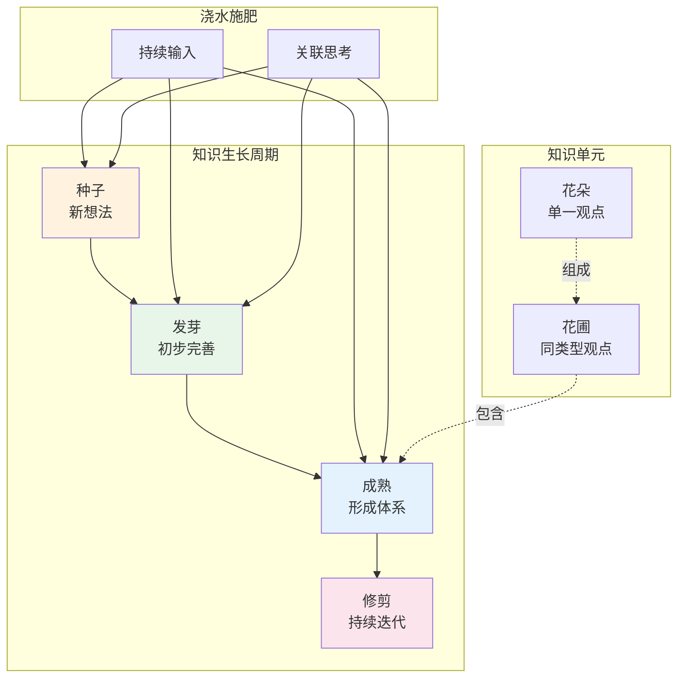

## 概念：数字花园

> 数字花园是一种公开的知识分享和生长哲学，强调观点像植物一样持续培育、迭代和连接。

**解决的核心痛点**：解决博客的「写完即弃」和第二大脑的「只读私有」问题——让知识在公开分享中持续生长

---

### 核心命题

- [[数字花园强调观点间的紧密联系]]
	- 知识单元比第二大脑更大，类似树形延申
- [[数字花园是第二大脑和博客的中间态]]
	- 兼具第二大脑的关联性和博客的公开性
- [[数字花园的状态反映了知识的成熟度]]
	- 种子 → 发芽 → 成熟 → 枯萎

---

### 运行机制

---

### 关键区别

| 维度 | 数字花园 | [[第二大脑]] | 博客 |
|:--- |:--- |:--- |:--- |
| **知识单元** | 单一观点延申（树形） | 观点发散（图形） | 主题汇总（花圃） |
| **检索方式** | 横向思维，顺藤摸瓜 | 多向检索 | 标签/分类 |
| **思维连续性** | 高 | 中 | 低 |
| **公开程度** | 公开 | 私有 | 公开 |
| **生长性** | 持续迭代 | 持续积累 | 写完即弃 |

---

### 应用场景

- ✅ **适用场景**
	- **公开学习**：在学习中公开思考过程，接受反馈
	- **知识连接**：让分散的观点形成网络
	- **个人品牌**：展示思考成长轨迹
- ⛔ **误用**
	- **只写不看**：建了花园但不维护
	- **追求完美**：等到「成熟」才发布，应该让想法先生长

---

### 知识图谱

- **父级概念**：[[A-知识管理]]
- **并列概念**：[[第二大脑]]
- **相关概念**：[[PARA笔记法]], [[卡片盒笔记法]]

---

### 参考延伸

- **来源**：Maggie Appleton 提出
- **相关实践**：Obsidian + Quartz 搭建数字花园
