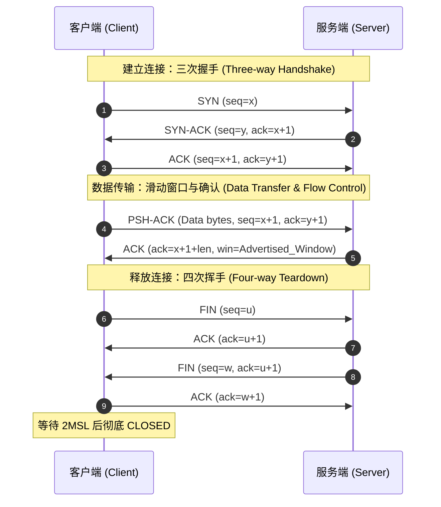

## 概念：TCP (Transmission Control Protocol)

> TCP 是一种面向连接的、可靠的、基于字节流的传输层通信协议。

**解决的核心痛点**：底层的 IP 网络是不可靠的「尽力而为（Best-Effort）」交付模型（存在丢包、乱序、重复和延迟）。TCP 在不可靠的信道之上，通过协议设计为应用层构建了绝对可靠且有序的双向数据流交付抽象。

### 核心命题

- [[可靠性是由确认重传与滑动窗口共同保证的物理抽象]]
- **原理**：TCP 通过序列号（Sequence Number）解决乱序与去重，通过累积确认（ACK）与重传计时器（RTO/Fast Retransmit）修复丢包，使不可靠介质呈现可靠流。
- [[TCP 将网络拥塞控制下沉为端到端的自我约束博弈]]
- **原理**：发送端不需要中间路由显式协同，而是通过拥塞窗口（cwnd）、慢启动、拥塞避免与丢包信号隐式推测链路承载力，在吞吐量与排队延迟之间维持动态平衡。
- [[面向连接的本质是端系统维护的有限状态机而非物理链路]]
- **原理**：TCP 的「连接」不存在于中间网络设备，而是通信双方通过握手在内存中初始化的状态变量（如序列号基准、窗口大小、缓冲区）。

### 运行机制

TCP 依靠**三次握手**建立对称连接与同步初始序列号（ISN），通过**滑动窗口**进行流水线式双向数据传输与流量控制，最终通过**四次挥手**实现双向通道的安全独立关闭。

代码段

### 关键区别

|**维度**|**TCP**|**[[UDP]]**|**[[QUIC]]**|
|---|---|---|---|
|**连接模型**|面向连接（三次握手，双端维护状态）|无连接（即发即弃）|基于 UDP 构建的用户态连接（0-RTT/1-RTT）|
|**可靠性与保序**|强可靠、严格保序、丢失必重传|不可靠、不保序、无重传|强可靠，单流内保序，多流无阻塞|
|**队头阻塞 (HoL)**|存在（单包丢失阻塞整条流）|不存在（独立数据报）|不存在（多路复用流之间互不阻塞）|
|**传输开销**|头部 20–60 字节，状态开销大|头部仅 8 字节，无状态开销|包含 TLS 1.3，用户态调度有一定 CPU 开销|
|**适用场景**|Web/API (HTTP/1.1-2)、文件传输、邮件|实时音视频 (RTP/WebRTC)、DNS、实时游戏|HTTP/3、移动弱网场景、高实时长连接|

### 适用范围

- ✅ **适用场景**
- **文本/文件与金融交易**：HTTP/1.1、HTTP/2、FTP、SSH、数据库协议，对数据完整性和准确性有 100% 的刚性要求。
- **点对点高吞吐传输**：大文件分发、数据备份，需要滑动窗口和拥塞控制榨干带宽。
- ⛔ **误用**
- **高频弱网音视频连麦**：弱网丢包时 TCP 的重传与队头阻塞会引入数百毫秒抖动，导致画面严重卡顿，违背实时互动诉求。
- **DNS 解析与微型信令交互**：握手带来的 1-RTT 延迟相对于单次极小查询（数十字节）开销过大。
- **失效边界**
- **高丢包率卫星/移动无线链路**：TCP 将所有丢包误判为网络拥塞并主动腰斩拥塞窗口，导致带宽利用率暴跌。
- **内核态演进停滞**：TCP 深度嵌入操作系统内核，协议栈算法升级（如 BBR、新选项）需要升级 OS，难以在应用层快速迭代。

### 批判

- **外部批判**
- **QUIC / HTTP/3 设计学派**：批评 TCP 将「传输流」与「传输连接」强行耦合，导致多路复用下的单一丢包引发全局**队头阻塞（Head-of-Line Blocking）**；同时连接依赖四元组导致移动端网络切换时无法实现**连接迁移（Connection Migration）**。
- **实时音视频架构派**：批评 TCP 内置且不可绕过的强可靠语义剥夺了业务层「舍弃陈旧数据以换取实时性」的自主裁量权。
- **内在张力**
- **延迟（Latency）与吞吐量（Throughput）的内在对抗**：拥塞控制算法若过度追求填满链路缓存会导致 **Bufferbloat（缓冲区膨胀）**，从而急剧推高 RTT 延迟；若过于保守则无法充分利用高带宽高延迟（BDP）链路。

### FAQ

- [[为什么 TCP 建立连接需要三次握手而不是两次或四次？]]
- [[TCP 为什么在断开连接时需要等待 2MSL 时间才进入 CLOSED 状态？]]
- [[TCP 的队头阻塞（Head-of-Line Blocking）是如何发生的？]]
- [[为什么 TCP 在弱网高丢包环境下传输效率会断崖式下降？]]
- [[TCP 粘包与拆包问题的本质是什么，应用层如何正确处理？]]

### SOP

- [[SOP-Wireshark排查TCP重传与连接异常流程]] — 定位三次握手失败、RST 异常重置及丢包重传的标准抓包分析链路。
- [[SOP-Linux内核TCP网络参数调优规范]] — 优化 `tcp_max_syn_backlog`、`tcp_tw_reuse`、`tcp_wmem`/`tcp_rmem` 及拥塞控制算法（如切换至 BBR）的标准配置流程。
- [[SOP-网络应用层自定义定长与边界协议设计指南]] — 规范解决应用层面对 TCP 字节流时的分包、定界与校验逻辑。

### 知识图谱

- **父级概念**：[[传输层协议]] — 提供端到端（进程到进程）逻辑通信的体系层级。
- **子级概念**：
	- [[TCP三次握手与四次挥手]] — 连接生命周期控制机制
	- [[TCP滑动窗口]] — 流量控制与数据流水线机制
	- [[TCP拥塞控制]] — 包括慢启动、拥塞避免、快重传与快恢复算法族（Reno, CUBIC, BBR）
	- [[TCP重传机制]] — 超时重传（RTO）、快速重传与 SACK（选择性确认）
- **并列概念**：
	- [[UDP]] — 传输层无连接、尽力而为的数据报协议
	- [[SCTP]] — 支持多宿主与多流特性的流控制传输协议
- **相关概念**：
	- [[QUIC]] — 基于 UDP 替代 TCP 的下一代通用传输协议
	- [[IP协议]] — 为 TCP 提供下层网络寻址与分片路由的无连接协议
	- [[HTTP协议]] — 典型建立在 TCP 字节流抽象之上的应用层协议
- **参考文章**
	- [RFC 9293 - Transmission Control Protocol (TCP)](https://www.rfc-editor.org/rfc/rfc9293)
	- [RFC 5681 - TCP Congestion Control](https://www.rfc-editor.org/rfc/rfc5681)
