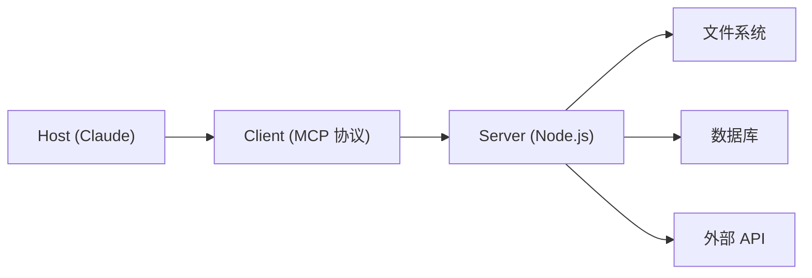

> 在掌握基础使用后，如何进一步释放 Claude Code 的潜力？本文将深入探讨 MCP、Hooks、Subagents 等进阶功能，帮助你构建真正定制化的自动化工作流。

---

## 引言

Claude Code 的进阶使用，核心在于 " 扩展 "——让它不仅仅是一个对话工具，而是成为你开发流程的一部分。

当你已经熟练使用基础命令后，会遇到几个关键问题：
- 如何连接外部服务（GitHub、Figma）？
- 如何自动化重复任务？
- 如何处理复杂的多步骤任务？

答案就在 MCP、Hooks 和 Subagents 中。

---

## 主体

### 一、MCP：连接外部世界

#### 1.1 什么是 MCP

MCP (Model Context Protocol) 是一个标准化协议，让 Claude 能安全地访问本地数据源和外部服务。

**架构**：



#### 1.2 常用 MCP 服务器

```bash
# GitHub MCP - PR 和 Issue 管理
npx @modelcontextprotocol/server-github

# 文件系统 - 访问指定目录
npx @modelcontextprotocol/server-filesystem /path/to/dir

# Puppeteer - 浏览器自动化
npx @modelcontextprotocol/server-puppeteer

# SQLite - 数据库查询
npx @modelcontextprotocol/server-sqlite
```

#### 1.3 配置 MCP 服务器

```bash
# 使用 /mcp 命令交互式配置
/mcp
```

或直接编辑配置文件：

```json
// ~/.claude/mcp.json
{
  "mcpServers": {
    "github": {
      "command": "npx",
      "args": ["-y", "@modelcontextprotocol/server-github"],
      "env": {
        "GITHUB_PERSONAL_ACCESS_TOKEN": "your-token"
      }
    },
    "filesystem": {
      "command": "npx",
      "args": ["-y", "@modelcontextprotocol/server-filesystem", "/path/to/project"]
    }
  }
}
```

#### 1.4 前端开发实战场景

- **Figma MCP**：直接读取设计稿，生成对应代码
- **GitHub MCP**：自动化 PR 审查、Issue 管理
- **数据库 MCP**：查询和分析数据

### 二、Hooks：事件驱动自动化

#### 2.1 Hooks 机制

Hooks 允许你在特定事件发生时自动执行操作，无需手动触发。

```json
// .claude/settings.json
{
  "hooks": {
    "PreCommit": ["npm run lint", "npm test"],
    "PostBuild": ["npm run analyze"],
    "OnFileChange": ["*.tsx", "npm run type-check"]
  }
}
```

#### 2.2 前端工作流示例

```json
{
  "hooks": {
    "PreCommit": [
      "npm run lint",
      "npm run type-check",
      "npm test -- --run"
    ]
  }
}
```

这意味着每次 `git commit` 前，Claude 都会自动运行：
1. ESLint 代码规范检查
2. TypeScript 类型检查
3. 单元测试

#### 2.3 权限配置

```json
{
  "permissions": {
    "allow": ["npm run *", "git *", "npx *"],
    "deny": ["rm -rf", "npm publish"]
  }
}
```

### 三、Subagents：任务委派

#### 3.1 什么是 Subagent

Subagent 是独立的子会话，拥有完全独立的上下文。适用于：
- 复杂任务拆分
- 长会话中的上下文管理
- 并行处理多个任务

#### 3.2 配置 Subagent

```yaml
# CLAUDE.md 或 /agents 配置
subagents:
  - name: reviewer
    description: 代码审查专家
    tools: [Read, Grep, Bash]
    instructions: 审查代码质量、安全性和性能

  - name: tester
    description: 测试工程师
    tools: [Bash, Read]
    instructions: 运行测试并分析覆盖率
```

#### 3.3 使用 Subagent

```bash
> 使用 reviewer 审查 src/components/ 目录
```

Claude 会创建一个独立的子会话进行审查，完成后返回摘要。

### 四、自定义工作流构建

#### 4.1 Skill 的高级用法

```yaml
---
name: component-gen
description: 生成 React 组件
argument-hint: 组件名称和功能描述
allowed-tools:
  - Read
  - Write
  - Edit
  - Glob
---

# Component Generator Skill

1. 读取项目组件模板 (templates/Component.tsx)
2. 根据输入生成组件代码
3. 创建组件文件 (src/components/{name}.tsx)
4. 创建测试文件 (src/components/{name}.test.tsx)
5. 更新组件索引 (src/components/index.ts)
```

#### 4.2 工作流编排

多个 Skills 可以组合成更复杂的工作流：

```bash
用户请求 → Skill 路由 → 执行 → 结果输出
```

例如：
- `/deploy` → 构建 → 测试 → 部署 → 通知

### 五、性能优化与成本控制

#### 5.1 上下文管理

```bash
/context    # 查看上下文占用
/compact    # 压缩历史
/clear      # 清除会话
```

**最佳实践**：
- 重要信息写入 CLAUDE.md
- 复杂任务使用 Subagent 隔离
- 定期 `/compact` 保持简洁

#### 5.2 模型选择

| 场景 | 推荐模型 |
|------|---------|
| 日常编码 | Sonnet (性价比高) |
| 复杂架构 | Opus (推理更强) |
| 快速修复 | Haiku (响应最快) |

```bash
/model claude-3-sonnet-20240229
# 或
/model claude-3-opus-20240229
```

#### 5.3 成本监控

```bash
/cost    # 查看会话成本
```

---

## 总结

进阶使用的核心是 " 自动化 " 和 " 扩展 "：

1. **MCP** - 连接外部服务，让 Claude 能访问更多数据源
2. **Hooks** - 事件驱动自动化，减少手动操作
3. **Subagents** - 任务委派，处理复杂场景
4. **Skills** - 自定义工作流，复用最佳实践

通过这些功能，你可以将 Claude Code 打造成完全定制化的开发助手。

---

## 相关阅读

- [[Claude Code 使用指南]]
- [[Claude Code]]
- [[MCP]]
- [[Skills 最佳实践(Claude Code).md]]
