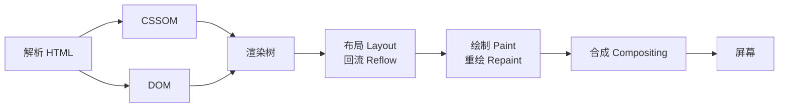

## 术语：回流和重绘

> **领域**：#前端/渲染性能

### 定义

| 术语 | 定义 |
|:---|:---|
| **回流 (Reflow)** | 浏览器重新计算元素几何属性（尺寸、位置），可能影响整个页面布局 |
| **重绘 (Repaint)** | 浏览器仅重新绘制元素外观（颜色、阴影），不改变布局 |

```bash
渲染过程：
解析 HTML/CSS → 渲染树 → 布局(Layout/回流) → 绘制(Paint/重绘) → 合成(Compositing)
```

### 浏览器渲染管线



### 何时触发

| 触发回流 | 仅触发重绘 |
|:---|:---|
| 元素尺寸变化（width、height） | 颜色变化（color、background-color） |
| 位置变化（margin、padding） | 可见性（visibility、outline） |
| 字体变化（font-size） | 阴影变化（box-shadow） |
| 添加/删除元素 | 透明度变化（opacity） |
| 浏览器窗口 resize |  |

### 性能影响

- **回流代价高**：可能影响整个页面布局，计算量大
- **重绘代价较低**：仅影响元素外观，但仍阻塞主线程
- **最坏情况**：连续多次回流/重绘导致掉帧、卡顿

### 优化策略

| 策略 | 方法 |
|:---|:---|
| **属性选择** | 优先使用 `transform`、`opacity`（仅触发合成，不触发回流/重绘） |
| **批量操作** | 使用 `DocumentFragment` 批量添加 DOM |
| **读写分离** | 先读所有布局属性，再写修改（避免强制同步回流） |
| **CSS 类批量修改** | 一次性切换 class，而非逐个修改 style |
| **display: none** | 隐藏元素后修改，再显示（避免中间触发） |
| **will-change** | 提示浏览器提前创建合成层 |

### 与合成层的关系

```bash
回流/重绘 → 主线程执行 → 可能阻塞
    ↓
使用 transform/opacity → 跳过回流/重绘 → 仅触发合成 → 合成线程执行 → 不阻塞主线程
```

- `transform` 和 `opacity` 的变化不会触发回流或重绘
- 浏览器为这些属性创建独立合成层
- 合成在 compositor thread 执行，不阻塞主线程

详见：[[合成层]]

### 知识网络

- **父级概念**：[[前端性能优化]] — 上位领域
- **相关概念**：
	- [[合成层]] — 不触发回流重绘的优化手段
	- [[will-change]] — 触发合成层的 CSS 属性
	- [[回流和重绘]] — 本笔记
- **关联笔记**：
	- [[怎样减少回流和重绘]] — 具体优化实践
	- [[SOP-实现磁吸式光标]] — 利用合成层优化的实践

### 参考资料

- [Google Web Dev - 渲染性能](https://web.dev/articles/rendering-performance)
- [CSS Triggers](https://csstriggers.com/)
