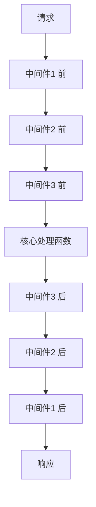

## 概念：中间件

> 中间件（Middleware）是一种在「请求 → 处理 → 响应」主流程中插入的、可组合的处理单元，它以统一的接口串联成链，让每个单元只关注一件事，并可选择在调用下一环前后执行逻辑。

**解决的核心痛点**：如果所有横切关注点（日志、鉴权、限流、错误处理、超时）都塞进核心处理函数，核心会被污染得难以维护、无法复用、无法按需组合。中间件通过「洋葱模型」把这些关注点拆成独立的链式单元，解决了「横切逻辑侵入核心流程」与「处理步骤难以灵活插拔/排序」的问题。

---

### 核心命题

> 核心命题引用 atomic 笔记（陈述句观点），每个命题是一句话洞见

- [[中间件通过「调用 next」把控制权交给下一环]]
	- **原理**：每个中间件签名为 `(ctx, next) => …`，不调用 `next()` 则流程终止；调用则进入下一环，形成可控的执行链。
- [[洋葱模型让中间件能在下游前后各执行一段逻辑]]
	- **原理**：`next()` 之前的代码在请求下行阶段执行，`next()` 之后的代码在响应上行阶段执行，因此天然适合做计时、事务、错误捕获。
- [[中间件是横切关注点的物理隔离]]
	- **原理**：日志、鉴权、限流等与业务无关的逻辑被拆到独立单元，核心处理函数只保留业务语义。
- [[中间件的顺序即语义]]
	- **原理**：鉴权必须早于业务、错误处理必须包住业务，注册顺序直接决定行为正确性，因此顺序是契约的一部分而非细节。
- [[中间件与 AOP/装饰器/管道是同族思想的不同实现]]
	- **原理**：它们都在「主流程」外挂一层可组合的旁路逻辑，区别只在于组合方式（链式 vs 切面 vs 装饰 vs 管道）。

---

### 运行机制

中间件按注册顺序组成一条链，框架用一个 `dispatch(i)` 递归函数驱动：执行第 `i` 个中间件，把 `() => dispatch(i+1)` 作为 `next` 传入。中间件内部可在 `await next()` 前后插入逻辑，形成洋葱式调用栈。



核心驱动代码只有几行：

```javascript
function compose(middlewares) {
  return function (ctx) {
    let index = -1;
    function dispatch(i) {
      if (i <= index) return Promise.reject(new Error('next() 被多次调用'));
      index = i;
      const fn = middlewares[i];
      if (!fn) return Promise.resolve();
      return Promise.resolve(fn(ctx, () => dispatch(i + 1)));
    }
    return dispatch(0);
  };
}
```

---

### 关键区别

| 维度 | 中间件 | 事件监听器 |
|:--- |:--- |:--- |
| **核心逻辑** | 链式、有序、可中断，控制权单向传递 | 广播、无顺序保证、不可中断主流程 |
| **适用场景** | 请求处理管道、需要顺序与拦截的场景 | 通知、解耦触发方与响应方 |
| **返回值语义** | `next()` 可返回下游结果，可包装 | 通常无返回值，互不影响 |

| 维度 | 中间件 | AOP 切面 |
|:--- |:--- |:--- |
| **核心逻辑** | 显式链式调用，运行时组合 | 编译期/运行时代理织入，隐式 |
| **适用场景** | 框架级请求管道 | 业务方法级横切（日志、事务） |

---

### 适用范围

- ✅ **适用场景**
	- **Web 框架请求管道**：Koa、Express、Gin 的核心抽象，处理 HTTP 请求的鉴权、日志、错误捕获。
	- **Agent 执行链路**：工具调用前后插入审批、超时、追踪，DSH 的 waterfall 事件即为中间件的变体。
	- **构建工具 / 编译器插件链**：Webpack loader、Babel plugin 本质也是中间件式处理管道。
- ⛔ **误用**
	- **把业务逻辑写成中间件**：业务应留在核心处理函数，中间件只处理横切关注点，否则链会膨胀且难追踪。
	- **无脑调用 `next()` 多次**：会触发下游重复执行，必须用 `index` 检查防止。
	- **依赖中间件的隐式副作用传递**：中间件之间通过 `ctx` 通信应有契约，随意挂载字段会让顺序依赖变脆。
- **失效边界**
	- 中间件模型只适合**线性管道**场景，对于分支、并行、条件跳转复杂的流程，链式结构表达能力不足，需图/工作流模型。
	- 它不解决「谁该被调用」的路由问题，路由与中间件是两层不同的抽象。

---

### 批判

- **外部批判**
	- **面向对象学派**：中间件把控制流用函数链硬编码，损失了类型与结构，装饰器/AOP 能提供更强的静态保证。
	- **数据流学派**：中间件通过共享 `ctx` 传递状态是隐式耦合，不如显式的数据管道（如 RxJS、Stream）可推理。
- **内在张力**
	- **灵活性与可预测性**：中间件越自由组合，全局行为越难静态推理，顺序错位往往只在运行时暴露。
	- **洋葱模型的深度即复杂度**：每加一层，调试时的调用栈就深一层，错误定位成本随之上升。

---

### FAQ

> 与本概念相关的开放性问题，先理解问题（发散），再看标准流程（收敛）

- [[中间件的 next() 机制是如何实现的？]]
- [[洋葱模型和链式调用有什么区别？]]
- [[中间件和事件监听器的本质区别是什么？]]
- [[为什么中间件顺序即语义？]]

---

### SOP

> 与本概念相关的标准操作流程，是 FAQ 中问题经过实践验证后的收敛成果

- [[编写中间件的 SOP]] — 定义签名、决定是否调用 next、把清理逻辑放在 next 之后
- [[调试中间件链的 SOP]] — 用日志或断点定位链中断位置，检查 next 是否被正确调用

---

### 知识图谱

> 知识图谱链接 term（术语定义）和相关 concept，建立概念关系网络

- **父级概念**：[[管道模式]] — 将处理步骤串联为链的架构模式
- **子级概念**：
	- [[洋葱模型]] — 中间件前后置逻辑的执行结构
	- [[compose 函数]] — 把中间件数组组合为单个可执行函数的驱动器
- **并列概念**：
	- [[事件监听器]] — 广播式、无顺序的响应机制
	- [[装饰器]] — 静态/编译期织入的横切逻辑
- **相关概念**：
	- [[AOP]] — 面向切面编程，中间件是其动态实现之一
	- [[责任链模式]] — 中间件是责任链在异步/管道场景的变体
	- [[waterfall 事件]] — DSH 中 around-middleware 的实现方式
- **参考文章**
	- Koa 源码 `compose` 实现
	- Express 中间件文档
	- DSH 事件系统文档
