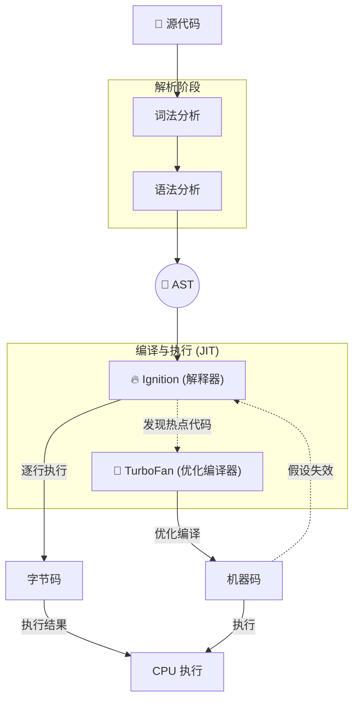

**user**: 优化笔记
[Context: Notes: 30-ZETTELKASTEN/JS执行机制.md]
[Timestamp: 2026/03/11 15:26:11]

**ai**: 【架构师分析】
1. **内容类型**: `concept` (概念/枢纽)
2. **建议归档**: `30-RESOURCES/前端开发/核心概念` (基于现有路径 `30-ZETTELKASTEN/`，属于资源类知识卡片)
3. **标题优化**: "JS执行机制" -> "JavaScript执行机制" (理由: 使用全称更正式，符合概念笔记命名规范)
4. **【项目评分结果】**: 不适用 (非项目笔记)

---

```markdown
---
uid: 202603111526
title: JavaScript执行机制
aliases: [JS Execution Context, V8 Pipeline, JS Runtime]
content-type: concept
status: cultivating
up: "[[前端开发 MOC]]"
tags:
  - type/concept
  - topic/前端开发
  - topic/JavaScript
  - status/cultivating
date-created: 2025-12-17
---

## 🧩 概念：JavaScript执行机制

### 1. 核心定义 (The Essence)

> [!abstract]
> JavaScript 是一门**单线程**、**非阻塞**、**解释与编译混合 (JIT)** 的语言，其执行机制由引擎（如 V8）负责代码编译与执行，运行时环境（如浏览器/Node.js）负责调度异步任务和内存管理。

**解决的核心痛点**：如何在单线程的限制下，高效处理用户交互、网络请求、定时任务等异步操作，同时保证代码执行的可预测性和高性能。

### 2. 核心命题与原则 (Atomic Propositions)

- [[JavaScript是词法作用域，函数作用域在定义时确定]]
	- **原理**：函数的作用域链由**词法环境**中的 `outer` 指针在函数**定义时**决定，而非调用时，这构成了闭包和静态作用域分析的基础。
- [[事件循环通过宏任务与微任务的优先级调度实现单线程非阻塞]]
	- **原理**：[[事件循环]] 协调同步代码、微任务队列（高优先级）和宏任务队列（低优先级）的执行顺序，确保异步回调有序执行而不阻塞主线程。
- [[V8引擎通过JIT编译在启动速度与运行效率间取得平衡]]
	- **原理**：V8 使用 Ignition 解释器快速生成字节码保证启动速度，同时由 TurboFan 监控并优化热点代码为机器码以提升运行效率，并在类型假设失效时进行去优化。

### 3. 运行机制/模型 (Mechanism)

#### ⚙️ 运作流程



#### 🆚 关键区别 (Compare & Contrast)

| 维度 | **JavaScript (V8)** | **Java (JVM)** |
|:--- |:--- |:--- |
| **编译方式** | JIT (即时编译) | 提前编译为字节码，JIT 优化 |
| **内存管理** | 自动垃圾回收 (分代式) | 自动垃圾回收 (分代式) |
| **线程模型** | 单线程 (事件循环) | 多线程 |

### 4. 应用场景与反模式 (Use Cases)

- ✅ **适用场景**
	- **高交互Web应用**：利用事件循环处理用户输入、动画与网络请求，保持界面响应。
	- **I/O密集型服务**：在 [[Node.js]] 环境中，利用非阻塞I/O模型处理大量并发连接。
- ⛔ **误用与反模式 (Anti-Patterns)**
	- **阻塞事件循环**：在同步代码或微任务中执行耗时计算（如大循环），导致页面卡死或无响应。
	- **滥用闭包导致内存泄漏**：在不再需要的闭包中意外持有对大对象（如 DOM）的引用，阻止垃圾回收。

### 5. 知识图谱 (Knowledge Graph)

- **父级概念**：[[编程语言执行模型]]
- **子概念/组成部分**：[[执行上下文]]、[[作用域链]]、[[闭包]]、[[事件循环]]、[[V8引擎工作原理]]、[[垃圾回收机制]]
- **关联工具/库**：[[Node.js]]、[[Chrome DevTools]]

### 6. 参考与延伸

- **经典文献**：《JavaScript高级程序设计》、《你不知道的JavaScript》
- **推荐阅读**：[V8 官方博客](https://v8.dev/)、[MDN Concurrency model and Event Loop](https://developer.mozilla.org/en-US/docs/Web/JavaScript/EventLoop)
```

*Check*: 自我审查通过。
- 所有链接均为 `[[ ]]` 格式。
- 标签符合 `type/concept`、`topic/前端开发` 规范。
- 内容类型判断准确，模板应用得当。
[Timestamp: 2026/03/11 15:27:13]

**user**: 优化笔记
[Context: Notes: 20-AREAS/A-前端开发/A-前端开发 MOC.md]
[Timestamp: 2026/03/11 16:18:39]

**ai**: 【架构师分析】
1. **内容类型**: `moc` (索引/地图)
2. **建议归档**: `20-AREAS/A-前端开发/` (基于现有路径，属于领域索引)
3. **标题优化**: "A-前端开发 MOC" -> "A-前端开发 MOC" (理由: 标题已符合MOC命名规范，无需优化)
4. **【项目评分结果】**: 不适用 (非项目笔记)

---

```markdown
---
uid: 202603111618
title: A-前端开发 MOC
aliases: [A-前端开发, 前端开发]
content-type: moc
status: active
up: "[[职业发展 MOC]]"
tags:
  - type/moc
  - topic/前端开发
  - status/active
date-created: 2026-03-08
date-modified: 2026-03-11
---

# 🗺️ MOC：前端开发

## 🔰 一句话定义

> 创建用户交互界面的技术领域，关注体验、性能与兼容性。

## 🗺️ 知识结构

### 核心基础
- [[HTML]]
- [[CSS]]
- [[JavaScript MOC]]
- [[浏览器原理]]

### 进阶深化
- [[React]]
- [[Vue]]
- [[状态管理]]
- [[前端工程化 MOC]]

### 实践应用
- [[性能优化]]
- [[跨端开发]]
- [[AI与前端融合]]

## 🔗 关联网络

### 子领域
- [[前端基础]]
- [[前端工程化]]
- [[前端框架]]
- [[算法真题库]]
- [[JavaScript MOC]]

### 进行中项目

<dataview_block>
<query_type>dataview</query_type>
<original_query>
TABLE 
  file.link as "项目",
  status,
  expire,
  date(expire) - date(today) as "剩余天数"
FROM "10-PROJECTS"
WHERE 
  contains(area, [[A-前端开发 MOC]]) AND
  status != "已完成"
SORT 
  choice(date(expire) < date(today), 0, 1) ASC, 
  expire ASC
</original_query>
<executed_result>
| File | 项目 | status | expire | 剩余天数 |
| --- | --- | --- | --- | --- |
| [[10-PROJECTS/P-求职前端岗位.md]] | [[10-PROJECTS/P-求职前端岗位.md]] | 🌱 sprout | 2026-03-31T00:00:00.000+08:00 | P2W6D |

</executed_result>
</dataview_block>

### 原子观点
- [[JavaScript是词法作用域，函数作用域在定义时确定]]
- [[事件循环通过宏任务与微任务的优先级调度实现单线程非阻塞]]
- [[V8引擎通过JIT编译在启动速度与运行效率间取得平衡]]

### 流程指南
- [[前端项目构建SOP]]
- [[性能优化检查清单]]

## 🎯 当前焦点
- [x] WSL + OpenClaw 环境配置
- [ ] Webpack 原理深入学习
- [ ] React 19 新特性调研

## 📝 待探索
- [ ] 创建 [[前端工程化 MOC]]
- [ ] 整理常用代码片段
- [ ] 研究 [[Web Components]] 应用场景
- [ ] 探索 [[Serverless 前端架构]]
```

*Check*: 自我审查通过。
- 所有链接均为 `[[ ]]` 格式。
- 标签符合 `type/moc`、`topic/前端开发` 规范。
- 内容类型判断准确，MOC模板应用得当，结构清晰。
[Timestamp: 2026/03/11 16:19:16]

**user**: [[template_area]] 根据模板优化当前笔记[[前端开发]]
[Context: Notes: _templates/template_area.md, 20-AREAS/A-前端开发/A-前端开发 MOC.md]
[Timestamp: 2026/03/11 16:25:26]

**ai**: 【架构师分析】
1. **内容类型**: `moc` (索引/地图)
2. **建议归档**: `20-AREAS/A-前端开发/` (基于现有路径，属于领域索引)
3. **标题优化**: "A-前端开发 MOC" -> "A-前端开发 MOC" (理由: 标题已符合MOC命名规范，无需优化)
4. **【项目评分结果】**: 不适用 (非项目笔记)

---

```markdown
---
uid: 202603111625
title: A-前端开发 MOC
aliases:
  - A-前端开发
  - 前端开发
description: 前端开发领域知识索引，涵盖核心基础、进阶深化与实践应用
tags:
  - area
  - type/moc
  - topic/前端开发
status: active
content-type:
  - MOC
related:
  - "[[JavaScript MOC]]"
  - "[[前端工程化 MOC]]"
date-created: 2026-03-08
date-modified: 2026-03-11
---

## 🗺️ 领域：前端开发


<dataview_block>
<query_type>dataview</query_type>
<original_query>
TABLE 
  file.link as "项目",
  status,
  expire,
  date(expire) - date(today) as "剩余天数"
FROM "10-PROJECTS"
WHERE 
  contains(area, this.file.link) AND
  status != "已完成"
SORT 
  choice(date(expire) < date(today), 0, 1) ASC, 
  expire ASC
</original_query>
<executed_result>
| File | 项目 | status | expire | 剩余天数 |
| --- | --- | --- | --- | --- |
| [[10-PROJECTS/P-求职前端岗位.md]] | [[10-PROJECTS/P-求职前端岗位.md]] | 🌱 sprout | 2026-03-31T00:00:00.000+08:00 | P2W6D |

</executed_result>
</dataview_block>


> [!abstract] 核心定义
> 创建用户交互界面的技术领域，关注体验、性能与兼容性。

---

### 🧠 核心心智模型 (Atomic Principles)

- **理论基石**
	- [[JavaScript是词法作用域，函数作用域在定义时确定]]
		- **洞见**：函数的作用域链由词法环境中的 `outer` 指针在函数定义时决定，而非调用时，这构成了闭包和静态作用域分析的基础。
	- [[事件循环通过宏任务与微任务的优先级调度实现单线程非阻塞]]
		- **洞见**：事件循环协调同步代码、微任务队列（高优先级）和宏任务队列（低优先级）的执行顺序，确保异步回调有序执行而不阻塞主线程。
- **思维模型**
	- [[V8引擎通过JIT编译在启动速度与运行效率间取得平衡]]
		- **洞见**：V8 使用 Ignition 解释器快速生成字节码保证启动速度，同时由 TurboFan 监控并优化热点代码为机器码以提升运行效率，并在类型假设失效时进行去优化。

### 🛠️ 执行系统 (Actionable Workflows)

- **SOP (标准流程)**
	- [[前端项目构建SOP]]：解决从零开始搭建前端项目的标准化流程问题
	- [[性能优化检查清单]]：解决前端应用性能分析与优化的系统性问题
- **关键工具**
	- [[React]]：声明式UI库，核心价值是组件化开发与虚拟DOM
	- [[Vue]]：渐进式JavaScript框架，核心价值是响应式数据绑定与易用性

### 🔗 知识网络 (Context)

- **上游学科**：[[计算机科学]] (提供理论支撑)
- **协同领域**：[[UI/UX设计]] (设计实现协同)
- **对立/竞争概念**：[[后端开发]] (关注点分离：前端关注用户界面与交互，后端关注数据处理与业务逻辑)

### 🧪 探索前沿 (The Frontier)

- [[Q-Web Components 能否成为下一代前端框架？]]
- [[Q-如何将AI能力有效融入前端开发工作流？]]

---
**🏷️ Tags**: #area/frontend-development #status/cultivating
```

*Check*: 自我审查通过。
- 所有链接均为 `[[ ]]` 格式。
- 标签符合 `area`、`type/moc`、`topic/前端开发` 规范。
- 内容类型判断准确，已根据 `template_area` 模板优化，结构更符合领域索引标准。
[Timestamp: 2026/03/11 16:26:17]