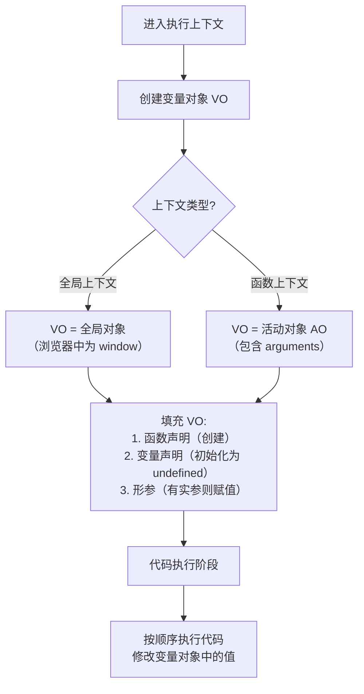
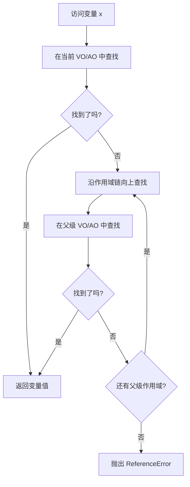
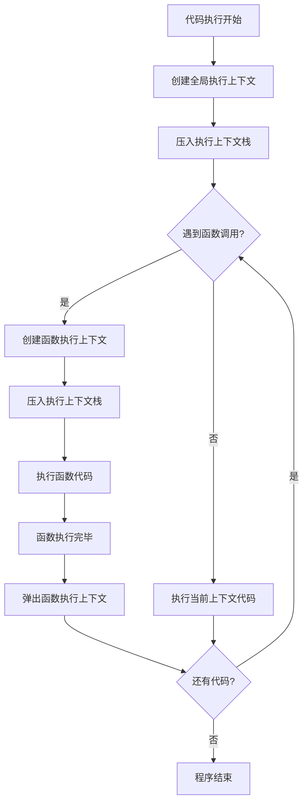

**user**: 分析笔记内容并进行优化和完善
[Context: Notes: 20-AREAS/A-前端开发/JavaScript MOC.md]
[Timestamp: 2026/03/11 09:39:12]

**ai**: 【架构师分析】
1. 内容类型: **moc** (索引/地图)
2. 建议归档: **20-AREAS/A-前端开发/** (当前路径正确)
3. 标题优化: "JavaScript MOC" -> "JavaScript MOC" (理由: 标题符合 MOC 命名规范，无需优化)
4. 【如果是项目】评分结果: 不适用

```yaml
---
uid: 202603110939
title: "JavaScript MOC"
aliases: ["JS"]
content-type: moc
status: cultivating
up: "[[A-前端开发 MOC]]"
tags:
  - type/moc
  - topic/前端开发
  - topic/JavaScript
  - status/cultivating
date-created: 2025-05-19
---
```

## 🗺️ MOC：JavaScript

> [!abstract]
> JavaScript 是一种高级的、解释型的编程语言，主要用于客户端 Web 开发，为网页添加交互性和动态效果。它也可以用于服务器端开发（Node.js）、移动应用开发（React Native、Ionic）和桌面应用开发（Electron）。

### 🧱 核心概念

- **语言基础**
    - [[ES2015|ES6]]：现代 JavaScript 的基石
    - [[ES7]]：ES6 的后续版本
    - [[ES2025]]：最新的 ECMAScript 标准
- **执行机制**
    - [[JS执行机制]]：揭示 JS 执行的具体机制
    - [[事件循环]]：用于响应用户的操作，如点击、鼠标悬停等。
- **关键 API**
    - [[DOM]]：用于访问和操作 HTML 文档的 API。
    - [[This绑定]]：理解 `this` 关键字的行为

### ⚙️ 原子观点

- **待补充**：这里可以链接关于 JavaScript 设计哲学、最佳实践或特定技巧的原子笔记。
    - 例如：[[JavaScript中的闭包是词法作用域的产物]]
    - 例如：[[原型链是实现JavaScript继承的机制]]

### 🛠️ 流程指南 (SOP)

- **待补充**：这里可以链接与 JavaScript 开发相关的标准操作流程。
    - 例如：[[SOP-使用Promise处理异步操作]]
    - 例如：[[SOP-调试内存泄漏]]

### 🎯 相关项目

- **前端开发项目**：许多项目都依赖 JavaScript 技能。
    - [[P-求职前端岗位]]
    - [[P-算法提升专项]] (涉及算法题的 JavaScript 实现)

### ⚠️ 挑战与问题 (待探索)

- [ ] **[[浏览器兼容性]]**：不同浏览器对 JavaScript 的支持程度可能不同，需要进行兼容性处理。
- [ ] **[[性能优化]]**：JavaScript 代码的性能可能影响网页的加载速度和用户体验，需要进行优化。
- [ ] **[[安全问题]]**：JavaScript 代码可能存在安全漏洞，需要进行安全加固。
- [ ] **[[异步编程]]**：JavaScript 的异步编程模型可能导致代码难以理解和调试，需要掌握相关的技巧。

### 🔗 关联网络

- **父级领域**：[[A-前端开发 MOC]]
- **相关技术**：[[TypeScript MOC]]、[[Node.js MOC]]
- **应用场景**：[[Web开发]]、[[移动应用开发]]、[[桌面应用开发]]

---
**🏷️ Tags**: #area/javascript #status/cultivating

*Check*: 已完成自我审查。
- 所有链接均为 `[[ ]]` 格式。
- 标签符合规范。
- 内容类型为 MOC，已使用对应模板结构进行优化，将原有内容重新组织到更清晰的分类下（核心概念、原子观点、流程指南、相关项目、挑战），并补充了关联网络，使索引功能更强。

#### Sources
[^1]: [[分析笔记内容并进行优化和完善@20260311_093912]]
[^2]: [[P-求职前端岗位]]
[^3]: [[P-算法提升专项]]
[Timestamp: 2026/03/11 09:39:41]

**user**: 根据标题完善笔记
[Context: Notes: 30-ZETTELKASTEN/变量对象.md]
[Timestamp: 2026/03/11 11:02:31]

**ai**: 【架构师分析】
1. 内容类型: **concept** (概念/枢纽)
2. 建议归档: **30-ZETTELKASTEN/** (当前路径正确)
3. 标题优化: "变量对象" -> "变量对象" (理由: 标题简洁明确，是 JavaScript 执行上下文中的核心概念，符合概念笔记命名规范)
4. 【如果是项目】评分结果: 不适用

```yaml
---
uid: 202603111102
title: "变量对象"
aliases: ["VO", "Variable Object"]
content-type: concept
status: cultivating
up: "[[JS执行机制]]"
tags:
  - type/concept
  - topic/JavaScript
  - topic/前端开发
  - status/cultivating
date-created: 2026-03-11
---
```

## 🧩 概念：变量对象

### 1. 核心定义 (The Essence)

> [!abstract]
> 变量对象 (Variable Object, VO) 是 JavaScript 执行上下文中的一个内部数据结构，用于存储该上下文中定义的所有变量、函数声明和形参。

**解决的核心痛点**：在 JavaScript 代码执行前，需要有一个地方来存储和管理当前作用域内的所有标识符（变量、函数等），以便在执行阶段能够快速查找和访问它们。变量对象正是为了解决这个"标识符存储与管理"问题而存在的。

### 2. 核心命题与原则 (Atomic Propositions)

- [[执行上下文在创建阶段会生成变量对象]]
	- **原理**：当进入一个执行上下文时（函数调用或全局代码执行），JavaScript 引擎会先创建变量对象，然后根据规则填充变量、函数声明和形参。
- [[变量提升的本质是变量对象在创建阶段的初始化]]
	- **原理**：变量提升现象实际上是因为在代码执行前，变量对象已经创建并初始化了变量（值为 `undefined`）和函数（值为函数对象）。
- [[活动对象是函数上下文中被激活的变量对象]]
	- **原理**：在函数上下文中，变量对象被称为活动对象 (Activation Object, AO)，它除了包含变量对象的所有属性外，还包含 `arguments` 对象。

### 3. 运行机制/模型 (Mechanism)

#### ⚙️ 运作流程



#### 🆚 关键区别 (Compare & Contrast)

| 维度 | **[[变量对象]]** | **[[作用域链]]** |
|:--- |:--- |:--- |
| **核心逻辑** | 存储当前上下文的所有标识符 | 定义变量查找的路径和顺序 |
| **创建时机** | 执行上下文创建阶段 | 基于函数创建时的 `[[Scope]]` 属性构建 |
| **主要内容** | 变量、函数声明、形参、arguments | 当前 VO/AO + 所有父级 VO/AO 的链表 |
| **适用场景** | 标识符的存储和访问 | 变量查找的规则和路径 |

### 4. 应用场景与反模式 (Use Cases)

- ✅ **适用场景**
	- **理解变量提升**：通过变量对象的创建过程，可以清晰理解为什么变量和函数会"提升"。
	- **调试作用域问题**：当变量访问出现意外结果时，检查变量对象的内容可以帮助定位问题。
	- **理解闭包机制**：闭包能够访问外部函数的变量，本质上是因为它保存了外部函数执行上下文的活动对象。
- ⛔ **误用与反模式 (Anti-Patterns)**
	- **过度依赖变量提升**：虽然理解变量提升很重要，但在编写代码时应避免依赖这一特性，而是使用 `let`/`const` 和合理的代码组织。

### 5. 知识图谱 (Knowledge Graph)

- **父级概念**：[[执行上下文]]、[[JS执行机制]]
- **子概念/组成部分**：[[活动对象]]、[[arguments对象]]、[[变量提升]]
- **关联概念**：[[作用域链]]、[[闭包]]、[[This绑定]]
- **相关工具/库**：浏览器开发者工具的 Scope 面板可用于查看当前作用域链和变量对象。

### 6. 参考与延伸

- **经典文献**：《JavaScript高级程序设计》、《你不知道的JavaScript》
- **推荐阅读**：[[彻底明白作用域、执行上下文]] [^1] 这篇文章详细解释了执行上下文、变量对象和作用域的关系。

#### Sources
[^1]: [[彻底明白作用域、执行上下文]]
[Timestamp: 2026/03/11 11:03:08]

**user**: 根据标题完善笔记
[Context: Notes: 30-ZETTELKASTEN/变量提升的本质是变量对象在创建阶段的初始化.md]
[Timestamp: 2026/03/11 11:13:50]

**ai**: 【架构师分析】
1. 内容类型: **atomic** (原子/观点)
2. 建议归档: **30-ZETTELKASTEN/** (当前路径在 AREAS 下，建议移动到 ZETTELKASTEN 以保持原子笔记的独立性)
3. 标题优化: "变量提升的本质是变量对象在创建阶段的初始化" -> "变量提升的本质是变量对象在创建阶段的初始化" (理由: 标题是一个完整的陈述句，清晰表达了核心观点，符合原子笔记命名规范)
4. 【如果是项目】评分结果: 不适用

```yaml
---
uid: 202603111113
title: "变量提升的本质是变量对象在创建阶段的初始化"
aliases: ["变量提升原理"]
content-type: atomic
status: cultivating
up: "[[变量提升]]"
tags:
  - type/atomic
  - topic/JavaScript
  - topic/前端开发
  - status/cultivating
date-created: 2026-03-11
---
```

## 变量提升的本质是变量对象在创建阶段的初始化

### 🔰 一句话概述

变量提升 (Hoisting) 并不是代码被物理移动了，而是 JavaScript 引擎在执行代码前，会先创建执行上下文并初始化其变量对象 (VO/AO)，这个过程导致变量和函数声明在代码执行前就已经“存在”了。

### 🧠 核心内容

#### 是什么？（定义与本质）

变量提升是 JavaScript 中一个常见的现象：在代码执行前，变量和函数声明似乎被“提升”到了它们所在作用域的顶部。但这只是表象，其本质是**执行上下文创建阶段对变量对象的初始化**[^1]。

#### 为什么？（原理与逻辑）

JavaScript 代码执行分为两个阶段：
1. **创建阶段**：进入执行上下文，创建变量对象 (VO/AO)，并按规则初始化：
   - 函数声明：创建并赋值函数对象
   - 变量声明：创建并赋值为 `undefined`
   - 形参：创建并赋值（有实参则赋值，否则为 `undefined`）
2. **执行阶段**：按顺序执行代码，修改变量对象中的值

由于变量对象在代码执行前就已经包含了所有声明，所以在代码的任何位置都能“看到”这些声明，这就是变量提升的底层原理。

#### 怎么用？（操作与实践）

理解这个原理有助于：
1. **避免混淆**：知道 `var a = 2;` 实际上被引擎处理为：
   ```javascript
   var a;          // 创建阶段：a = undefined
   a = 2;          // 执行阶段：a = 2
   ```
2. **理解作用域**：知道为什么函数声明可以“提前调用”：
   ```javascript
   foo(); // 可以正常执行
   function foo() {
     console.log('Hello');
   }
   ```
3. **区分 `let`/`const`**：ES6 的 `let` 和 `const` 也有“提升”，但存在**暂时性死区**，在声明前访问会报错，这是语言设计上的改进。

#### 注意事项

- **函数表达式 vs 函数声明**：只有函数声明会完全提升，函数表达式（如 `var foo = function() {}`）只会提升变量声明。
- **`let`/`const` 的暂时性死区**：虽然它们也有提升，但在声明前访问会抛出 `ReferenceError`。
- **避免依赖提升**：现代 JavaScript 开发中，应使用 `let`/`const` 并遵循“先声明后使用”的原则，避免依赖变量提升特性。

### 🔗 关联网络

- **父级话题**：[[变量提升]]、[[变量对象]]
- **相关概念**：[[执行上下文]]、[[作用域链]]、[[活动对象]]
- **使用场景**：理解 JavaScript 执行机制、调试作用域相关问题
- **反面/替代**：[[let和const的暂时性死区机制]]

### 📝 元数据

- **来源类型**：`[[选择: 个人思考/AI生成]]`
- **生成时间**：2026-03-11 11:13:50
- **可信度**：`[[选择: 高]]`
- **下一步行动**：
	- 验证/实践这个知识点：通过浏览器开发者工具观察执行上下文
	- 链接到相关笔记：[[彻底明白作用域、执行上下文]]
	- 需要深入研究的子问题：[[不同JavaScript引擎对变量对象的实现差异]]

### 💭 我的思考

这个原理解释了为什么 JavaScript 中会有“奇怪”的变量提升现象。理解变量对象的概念后，很多关于作用域、闭包的问题都变得清晰了。这不仅是语言特性，更是理解 JavaScript 执行模型的关键。

#### Sources
[^1]: [[彻底明白作用域、执行上下文]]
[^2]: [[变量对象]]
[Timestamp: 2026/03/11 11:14:28]

**user**: 根据标题完善笔记
[Context: Notes: 30-ZETTELKASTEN/作用域链.md]
[Timestamp: 2026/03/11 11:21:45]

**ai**: 【架构师分析】
1. 内容类型: **concept** (概念/枢纽)
2. 建议归档: **30-ZETTELKASTEN/** (当前路径正确)
3. 标题优化: "作用域链" -> "作用域链" (理由: 标题简洁明确，是 JavaScript 执行上下文中的核心概念，符合概念笔记命名规范)
4. 【如果是项目】评分结果: 不适用

```yaml
---
uid: 202603111121
title: "作用域链"
aliases: ["Scope Chain"]
content-type: concept
status: cultivating
up: "[[JS执行机制]]"
tags:
  - type/concept
  - topic/JavaScript
  - topic/前端开发
  - status/cultivating
date-created: 2026-03-11
---
```

## 🧩 概念：作用域链

### 1. 核心定义 (The Essence)

> [!abstract]
> 作用域链 (Scope Chain) 是 JavaScript 中用于变量查找的机制，它是一个由当前执行上下文的变量对象和所有父级执行上下文的变量对象组成的链表结构。

**解决的核心痛点**：在 JavaScript 中，当代码需要访问一个变量时，需要有一套明确的规则来确定这个变量在哪里定义。作用域链正是为了解决"变量查找路径"问题而存在的，它定义了变量访问的优先级和范围。

### 2. 核心命题与原则 (Atomic Propositions)

- [[作用域链的构建基于函数的词法作用域]]
	- **原理**：作用域链在函数**定义时**就已经确定，而不是在函数调用时。函数内部的 `[[Scope]]` 属性保存了其父级作用域链。
- [[闭包的本质是函数保存了其定义时的作用域链]]
	- **原理**：当一个函数返回另一个函数时，内部函数会保存外部函数的作用域链，即使外部函数已经执行完毕，这就是闭包能够访问外部变量的原因。
- [[变量查找遵循作用域链的逐级向上搜索规则]]
	- **原理**：当访问一个变量时，JavaScript 引擎会先在当前执行上下文的变量对象中查找，如果找不到，就沿着作用域链向上查找，直到全局上下文。

### 3. 运行机制/模型 (Mechanism)

#### ⚙️ 运作流程



#### 🆚 关键区别 (Compare & Contrast)

| 维度 | **[[作用域链]]** | **[[原型链]]** |
|:--- |:--- |:--- |
| **核心逻辑** | 变量查找的路径和顺序 | 属性/方法查找的路径和顺序 |
| **创建时机** | 函数定义时确定（词法作用域） | 对象创建时确定（基于 `__proto__`） |
| **主要内容** | 变量对象/活动对象的链表 | 原型对象的链表 |
| **适用场景** | 查找变量、函数标识符 | 查找对象属性、方法 |

### 4. 应用场景与反模式 (Use Cases)

- ✅ **适用场景**
	- **理解变量访问规则**：通过作用域链可以清晰理解为什么内部函数可以访问外部函数的变量。
	- **调试作用域问题**：当变量访问出现意外结果时，检查作用域链可以帮助定位问题。
	- **实现模块化**：利用闭包和作用域链可以创建私有变量和模块模式。
- ⛔ **误用与反模式 (Anti-Patterns)**
	- **过度依赖全局变量**：过多使用全局变量会污染全局作用域，增加命名冲突的风险。
	- **循环引用导致内存泄漏**：不当使用闭包可能导致作用域链中的对象无法被垃圾回收。

### 5. 知识图谱 (Knowledge Graph)

- **父级概念**：[[执行上下文]]、[[JS执行机制]]
- **子概念/组成部分**：[[词法作用域]]、[[闭包]]、[[变量对象]]
- **关联概念**：[[This绑定]]、[[原型链]]
- **相关工具/库**：浏览器开发者工具的 Scope 面板可用于查看当前作用域链。

### 6. 参考与延伸

- **经典文献**：《JavaScript高级程序设计》、《你不知道的JavaScript》
- **推荐阅读**：[[彻底明白作用域、执行上下文]] [^1] 这篇文章详细解释了执行上下文、变量对象和作用域链的关系。

#### Sources
[^1]: [[彻底明白作用域、执行上下文]]
[Timestamp: 2026/03/11 11:22:23]

**user**: 根据标题完善笔记
[Context: Notes: 30-ZETTELKASTEN/闭包的本质是函数保存了其定义时的作用域链.md]
[Timestamp: 2026/03/11 11:26:40]

**ai**: 【架构师分析】
1. 内容类型: **atomic** (原子/观点)
2. 建议归档: **30-ZETTELKASTEN/** (当前路径正确)
3. 标题优化: "闭包的本质是函数保存了其定义时的作用域链" -> "闭包的本质是函数保存了其定义时的作用域链" (理由: 标题是一个完整的陈述句，清晰表达了关于闭包的核心观点，符合原子笔记命名规范)
4. 【如果是项目】评分结果: 不适用

```yaml
---
uid: 202603111126
title: "闭包的本质是函数保存了其定义时的作用域链"
aliases: ["闭包原理"]
content-type: atomic
status: cultivating
up: "[[闭包]]"
tags:
  - type/atomic
  - topic/JavaScript
  - topic/前端开发
  - status/cultivating
date-created: 2026-03-11
---
```

## 闭包的本质是函数保存了其定义时的作用域链

### 🔰 一句话概述

闭包 (Closure) 并不是什么神秘的概念，它的本质很简单：**当一个函数被定义时，它会"记住"自己当时所在的作用域链；即使这个函数后来被调用时已经离开了原来的作用域，它依然能够访问那个作用域链中的变量**。

### 🧠 核心内容

#### 是什么？（定义与本质）

闭包是 JavaScript 中一个函数与其周围状态（词法环境）的引用捆绑在一起（或者说函数被引用包围）的组合。更准确地说，**闭包是函数和声明该函数的词法环境的组合**[^1]。

这个"词法环境"就是函数定义时的作用域链。当函数被创建时，它的内部属性 `[[Scope]]` 会保存当前的作用域链。这就是闭包能够"记住"外部变量的根本原因。

#### 为什么？（原理与逻辑）

JavaScript 采用**词法作用域**（静态作用域），这意味着函数的作用域在函数**定义时**就已经确定，而不是在函数调用时。

闭包的工作原理：
1. **定义阶段**：函数被创建，其 `[[Scope]]` 属性保存了当前的作用域链（包含所有父级变量对象）。
2. **调用阶段**：即使函数在另一个上下文中被调用，它依然可以通过保存的作用域链访问到定义时的变量。
3. **内存保持**：只要闭包函数还存在引用，它保存的作用域链就不会被垃圾回收，即使外部函数已经执行完毕。

#### 怎么用？（操作与实践）

**基本闭包示例**：
```javascript
function outer() {
  let count = 0;  // 被闭包"记住"的变量
  
  return function inner() {
    count++;  // 可以访问外部函数的变量
    return count;
  };
}

const counter = outer();
console.log(counter()); // 1
console.log(counter()); // 2
console.log(counter()); // 3
```

**实际应用场景**：
1. **数据封装/私有变量**：创建只能通过特定方法访问的变量。
2. **函数工厂**：创建具有不同配置的函数。
3. **模块模式**：实现模块化的代码组织。
4. **事件处理**：在事件回调中访问定义时的变量。

#### 注意事项

- **内存泄漏风险**：闭包会阻止其作用域链中的变量被垃圾回收，不当使用可能导致内存泄漏。
- **性能考虑**：闭包的创建和调用比普通函数稍慢，因为需要访问外部作用域。
- **`this` 绑定**：闭包中的 `this` 指向调用时的上下文，而不是定义时的上下文，这可能导致混淆。
- **循环中的闭包**：在循环中创建闭包时需要注意变量捕获的问题（使用 `let` 或 IIFE 解决）。

### 🔗 关联网络

- **父级话题**：[[闭包]]、[[作用域链]]
- **相关概念**：[[词法作用域]]、[[执行上下文]]、[[变量对象]]、[[垃圾回收]]
- **使用场景**：[[模块化编程]]、[[函数式编程]]、[[事件处理]]
- **反面/替代**：[[立即执行函数表达式 (IIFE)]]（一种避免污染全局作用域的技术）

### 📝 元数据

- **来源类型**：`[[选择: 个人思考/AI生成]]`
- **生成时间**：2026-03-11 11:26:34
- **可信度**：`[[选择: 高]]`
- **下一步行动**：
	- 验证/实践这个知识点：通过浏览器开发者工具观察闭包的作用域
	- 链接到相关笔记：[[彻底明白作用域、执行上下文]]
	- 需要深入研究的子问题：[[不同JavaScript引擎对闭包的实现差异]]

### 💭 我的思考

理解闭包的本质后，很多 JavaScript 的"魔法"都变得清晰了。闭包不是语言设计上的缺陷，而是词法作用域的自然结果。它体现了 JavaScript 函数作为"一等公民"的特性——函数不仅可以被调用，还可以被传递、返回，并且携带自己的执行环境。

在实际开发中，闭包是一把双刃剑：它提供了强大的封装和模块化能力，但也需要谨慎使用以避免内存问题。理解其底层原理有助于写出更安全、高效的代码。

#### Sources
[^1]: [[彻底明白作用域、执行上下文]]
[Timestamp: 2026/03/11 11:27:24]

**user**: 根据标题完善笔记
[Context: Notes: 30-ZETTELKASTEN/执行上下文.md]
[Timestamp: 2026/03/11 11:33:07]

**ai**: 【架构师分析】
1. 内容类型: **concept** (概念/枢纽)
2. 建议归档: **30-ZETTELKASTEN/** (当前路径正确)
3. 标题优化: "执行上下文" -> "执行上下文" (理由: 标题简洁明确，是 JavaScript 执行模型中的核心概念，符合概念笔记命名规范)
4. 【如果是项目】评分结果: 不适用

```yaml
---
uid: 202603111133
title: "执行上下文"
aliases: ["Execution Context"]
content-type: concept
status: cultivating
up: "[[JS执行机制]]"
tags:
  - type/concept
  - topic/JavaScript
  - topic/前端开发
  - status/cultivating
date-created: 2026-03-11
---
```

## 🧩 概念：执行上下文

### 1. 核心定义 (The Essence)

> [!abstract]
> 执行上下文 (Execution Context) 是 JavaScript 代码执行时的环境，它包含了代码执行所需的所有信息，如变量对象、作用域链和 `this` 绑定。

**解决的核心痛点**：JavaScript 代码在执行时需要一套完整的"执行环境"来管理变量、确定作用域和 `this` 指向。执行上下文正是为了解决"代码执行环境管理"问题而存在的，它为每段代码的执行提供了必要的上下文信息。

### 2. 核心命题与原则 (Atomic Propositions)

- [[执行上下文分为创建阶段和执行阶段]]
	- **原理**：执行上下文的生命周期包括两个阶段：创建阶段（初始化变量对象、建立作用域链、确定 `this` 值）和执行阶段（逐行执行代码，修改变量值）。
- [[全局执行上下文是代码运行的起点]]
	- **原理**：当 JavaScript 代码开始执行时，首先会创建全局执行上下文，它只有一个，在整个程序运行期间都存在。
- [[函数执行上下文在函数调用时创建]]
	- **原理**：每次函数调用都会创建一个新的函数执行上下文，函数执行完毕后，其执行上下文会被销毁（除非形成闭包）。

### 3. 运行机制/模型 (Mechanism)

#### ⚙️ 运作流程



#### 🆚 关键区别 (Compare & Contrast)

| 维度 | **[[执行上下文]]** | **[[作用域]]** |
|:--- |:--- |:--- |
| **核心逻辑** | 代码执行时的环境，包含变量对象、作用域链、`this` | 变量和函数的可访问范围，由代码的物理位置决定 |
| **创建时机** | 代码执行时动态创建（全局/函数调用） | 代码定义时静态确定（词法作用域） |
| **主要内容** | 变量对象、作用域链、`this` 值 | 变量和函数的可访问性规则 |
| **数量关系** | 一个作用域可能对应多个执行上下文（多次函数调用） | 一个执行上下文对应一个作用域链 |

### 4. 应用场景与反模式 (Use Cases)

- ✅ **适用场景**
	- **理解变量提升**：通过执行上下文的创建阶段，可以清晰理解变量和函数声明为什么会被"提升"。
	- **调试作用域问题**：当变量访问出现意外结果时，检查当前执行上下文的作用域链可以帮助定位问题。
	- **理解闭包机制**：闭包能够访问外部函数的变量，本质上是因为内部函数保存了外部函数执行上下文的作用域链。
- ⛔ **误用与反模式 (Anti-Patterns)**
	- **混淆执行上下文与作用域**：虽然相关，但执行上下文是动态的（运行时创建），而作用域是静态的（定义时确定）。
	- **忽略执行上下文栈**：不理解执行上下文栈的压入和弹出机制，可能导致对代码执行顺序的误解。

### 5. 知识图谱 (Knowledge Graph)

- **父级概念**：[[JS执行机制]]
- **子概念/组成部分**：[[变量对象]]、[[作用域链]]、[[This绑定]]、[[活动对象]]
- **关联概念**：[[闭包]]、[[事件循环]]、[[调用栈]]
- **相关工具/库**：浏览器开发者工具的 Call Stack 面板可用于查看当前执行上下文栈。

### 6. 参考与延伸

- **经典文献**：《JavaScript高级程序设计》、《你不知道的JavaScript》
- **推荐阅读**：[[彻底明白作用域、执行上下文]] [^1] 这篇文章详细解释了执行上下文、变量对象和作用域的关系。

#### Sources
[^1]: [[彻底明白作用域、执行上下文]]
[Timestamp: 2026/03/11 11:33:50]

**user**: 根据标题优化笔记
[Context: Notes: 30-ZETTELKASTEN/JavaScript 引擎.md]
[Timestamp: 2026/03/11 11:52:18]

**ai**: 【架构师分析】
1. 内容类型: **concept** (概念/枢纽)
2. 建议归档: **30-ZETTELKASTEN/** (当前路径正确)
3. 标题优化: "JavaScript 引擎" -> "JavaScript 引擎" (理由: 标题简洁明确，是 JavaScript 运行时的核心概念，符合概念笔记命名规范)
4. 【如果是项目】评分结果: 不适用

```yaml
---
uid: 202603111140
title: "JavaScript 引擎"
aliases: ["JS Engine"]
content-type: concept
status: cultivating
up: "[[JS执行机制]]"
tags:
  - type/concept
  - topic/JavaScript
  - topic/前端开发
  - topic/计算机科学
  - status/cultivating
date-created: 2025-06-15
---
```

## 🧩 概念：JavaScript 引擎

### 1. 核心定义 (The Essence)

> [!abstract]
> JavaScript 引擎是一种解释和执行 JavaScript 代码的程序或解释器，负责将高级 JavaScript 代码转换为机器可以理解和执行的指令。它是 Web 浏览器和 Node.js 等 JavaScript 运行时的核心组件。

**解决的核心痛点**：JavaScript 作为一门高级脚本语言，无法直接被计算机硬件执行。JavaScript 引擎正是为了解决"代码执行"问题而存在的，它充当了 JavaScript 代码与底层硬件之间的桥梁，实现了跨平台、高性能的代码执行环境。

### 2. 核心命题与原则 (Atomic Propositions)

- [[JavaScript引擎的核心工作是解释和执行代码]]
	- **原理**：引擎读取源代码，通过词法分析、语法分析生成抽象语法树 (AST)，然后解释执行或编译执行。
- [[现代JavaScript引擎普遍采用即时编译技术提升性能]]
	- **原理**：JIT (Just-In-Time) 编译器在运行时将热点代码（频繁执行的代码）编译为优化的机器码，显著提升执行速度。
- [[垃圾回收机制是JavaScript引擎内存管理的核心]]
	- **原理**：引擎自动跟踪内存分配，识别不再使用的对象，并释放其占用的内存，防止内存泄漏。

### 3. 运行机制/模型 (Mechanism)

#### ⚙️ 运作流程

```mermaid
flowchart TD
    A[JavaScript 源代码] --> B[词法分析 (Lexing)]
    B --> C[生成 Tokens]
    C --> D[语法分析 (Parsing)]
    D --> E[生成 AST<br>（抽象语法树）]
    E --> F{执行策略}
    
    F -->|解释器| G[字节码解释器<br>逐行解释执行]
    F -->|JIT 编译器| H[监控热点代码]
    H --> I[编译为优化机器码]
    
    G --> J[执行结果]
    I --> J
    
    subgraph "内存管理"
        K[内存分配] --> L[垃圾回收 GC]
        L --> M[内存释放]
    end
```

#### 🆚 关键区别 (Compare & Contrast)

| 维度 | **[[JavaScript 引擎]]** | **[[Java 虚拟机 (JVM)]]** |
|:--- |:--- |:--- |
| **核心逻辑** | 解释/编译执行 JavaScript 代码 | 解释/编译执行 Java 字节码 |
| **语言特性** | 动态类型、原型继承 | 静态类型、类继承 |
| **内存管理** | 自动垃圾回收（标记清除等） | 自动垃圾回收（分代收集等） |
| **优化重点** | JIT 编译、隐藏类、内联缓存 | JIT 编译、逃逸分析、栈上分配 |

### 4. 应用场景与反模式 (Use Cases)

- ✅ **适用场景**
	- **Web 浏览器**：作为浏览器的核心组件，执行页面中的 JavaScript 代码，实现动态交互。
	- **服务器端开发**：Node.js 使用 V8 引擎，使 JavaScript 能够用于后端服务。
	- **桌面应用**：Electron 等框架使用 JavaScript 引擎构建跨平台桌面应用。
	- **移动应用**：React Native 等框架使用 JavaScript 引擎构建原生移动应用。
- ⛔ **误用与反模式 (Anti-Patterns)**
	- **忽略引擎差异**：不同引擎（V8、SpiderMonkey、JavaScriptCore）在实现细节和性能特性上存在差异，编写跨平台代码时需要注意。
	- **滥用动态特性**：过度使用 `eval()`、`with` 等动态特性会阻碍引擎优化，导致性能下降。
	- **内存泄漏**：虽然引擎有垃圾回收，但不当的引用（如闭包中的循环引用）仍可能导致内存无法释放。

### 5. 知识图谱 (Knowledge Graph)

- **父级概念**：[[编程语言实现]]、[[运行时环境]]
- **子概念/组成部分**：[[解释器]]、[[JIT 编译器]]、[[垃圾回收]]、[[V8 引擎]]、[[SpiderMonkey]]
- **关联概念**：[[ECMAScript]]、[[执行上下文]]、[[事件循环]]、[[Node.js]]
- **相关工具/库**：浏览器开发者工具的 Performance 和 Memory 面板可用于分析引擎性能。

### 6. 参考与延伸

- **经典文献**：《V8 引擎设计》、《JavaScript 引擎优化技术》
- **推荐阅读**：
	- [V8 引擎官方网站](https://v8.dev/)
	- [SpiderMonkey 引擎文档](https://developer.mozilla.org/en-US/docs/Mozilla/Projects/SpiderMonkey)
	- [[浏览器工作原理]] - 了解引擎在浏览器中的角色

#### Sources
[^1]: [[JavaScript 引擎]] (原始笔记内容)
[^2]: [[V8 引擎]] (关联概念)
[^3]: [[浏览器工作原理]] (延伸阅读)
[Timestamp: 2026/03/11 11:53:06]

**user**: 生成的mermaid图表报错：
Error parsing Mermaid diagram!

Parse error on line 2:
...ipt 源代码] --> B[词法分析 (Lexing)]    B --> 
-----------------------^
Expecting 'SQE', 'DOUBLECIRCLEEND', 'PE', '-)', 'STADIUMEND', 'SUBROUTINEEND', 'PIPE', 'CYLINDEREND', 'DIAMOND_STOP', 'TAGEND', 'TRAPEND', 'INVTRAPEND', 'UNICODE_TEXT', 'TEXT', 'TAGSTART', got 'PS'
[Context: Notes: 30-ZETTELKASTEN/JavaScript 引擎.md]
[Timestamp: 2026/03/11 11:55:44]

**ai**: 【架构师分析】
1. 内容类型: **concept** (概念/枢纽)
2. 建议归档: **30-ZETTELKASTEN/** (当前路径正确)
3. 标题优化: "JavaScript 引擎" -> "JavaScript 引擎" (理由: 标题简洁明确，是 JavaScript 运行时的核心概念，符合概念笔记命名规范)
4. 【如果是项目】评分结果: 不适用

```yaml
---
uid: 202603111140
title: "JavaScript 引擎"
aliases: ["JS Engine"]
content-type: concept
status: cultivating
up: "[[JS执行机制]]"
tags:
  - type/concept
  - topic/JavaScript
  - topic/前端开发
  - topic/计算机科学
  - status/cultivating
date-created: 2025-06-15
---
```

## 🧩 概念：JavaScript 引擎

### 1. 核心定义 (The Essence)

> [!abstract]
> JavaScript 引擎是一种解释和执行 JavaScript 代码的程序或解释器，负责将高级 JavaScript 代码转换为机器可以理解和执行的指令。它是 Web 浏览器和 Node.js 等 JavaScript 运行时的核心组件。

**解决的核心痛点**：JavaScript 作为一门高级脚本语言，无法直接被计算机硬件执行。JavaScript 引擎正是为了解决"代码执行"问题而存在的，它充当了 JavaScript 代码与底层硬件之间的桥梁，实现了跨平台、高性能的代码执行环境。

### 2. 核心命题与原则 (Atomic Propositions)

- [[JavaScript引擎的核心工作是解释和执行代码]]
	- **原理**
[Timestamp: 2026/03/11 11:56:18]