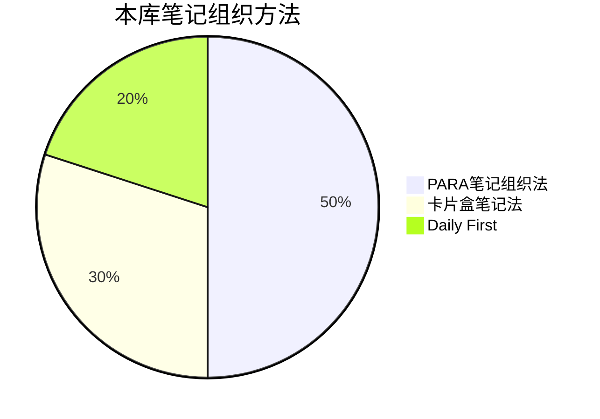

## 前言

本库采用 [[PARA笔记组织法]] + [[Zettelkasten (卡片盒笔记法)|卡片盒笔记法]] + Daily Note First

- 方法论参见：[[知识组织概述]]
- 工作流参见：[[PARA实施工作流]]
- 疑难问题参见：[[Q1：按照 PARA 笔记组织法，我创建了以下的笔记结构，这种结构不冗余吗？应该怎样优化？]]

## 一、文件系统

[[文件结构设计]]

## 二、符号系统
