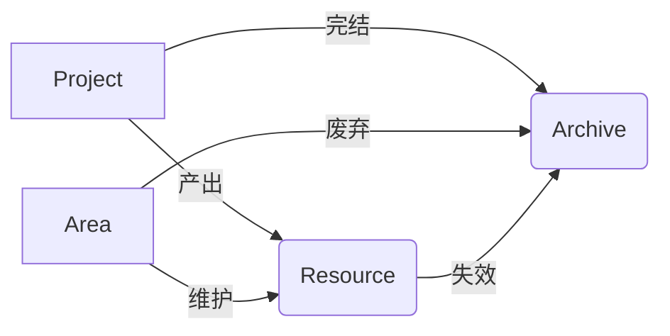

---
topic:
uid: 202408232200
title: PARA笔记法
aliases: [PARA, PARA笔记组织法]
author: pedyc
description:
tags: [PARA, 方法论, 知识管理/知识组织, 领域]
date-created: 2024-08-21
date-modified: 2025-12-13
status: done
type:
---

## 前言

PARA 是一种知识管理的方法论，由 Tiago Forte 在《构建第二大脑》中提出。它颠覆了传统分类逻辑，**以行动为中心**而非知识类型来组织信息。

一般而言，PARA 笔记法将笔记分为四个维度：
- Project：项目，具有截止日期和产出目标的行动
- Area：责任领域，没有截止日期但需要长期维护
- Resource：资源，可被复用的知识资产
- Archive：归档，非活跃的项目、领域和资源

## 一、PARA 核心原则

参见：![[PARA核心原则]]

---

## 二、四大模块定义与区别

| 模块              | 核心特征       | 生命周期 | 典型内容示例              | 判断标准               |
| --------------- | ---------- | ---- | ------------------- | ------------------ |
| 项目 Projects  | 有明确起止时间和目标 | 短期   | "2024 Q3 产品上线计划 "   | 能否用动词描述（完成/实现 XX）  |
| 领域 Areas     | 需长期维护的责任领域 | 持续   | " 健康管理 "、" 客户关系维护 " | 是否涉及持续标准（保持/提升 XX） |
| 资源 Resources | 潜在有用的参考资料  | 不确定  | " 行业白皮书 "、" 设计灵感库 " | 是否可能在未来被多个场景调用     |
| 归档 Archives  | 已完成/失效的内容  | 冻结   | "2022 旧版项目文档 "      | 是否 6 个月内未被使用       |
|                 |            |      |                     |                    |

四者协作关系：

## 三、PARA 实施工作流

参见：![[PARA实施工作流]]

## 四、注意事项

> [!hint] 什么时候整理？
> Just-in-time，不要专门找一个时间（例如周末）来整理笔记，只有当你需要用到某个笔记却难以找到时再去整理。

## 五、FAQ

- [[如何区分Project和Area？]]
- [[Resource 文件夹中笔记太乱怎么办？]]
