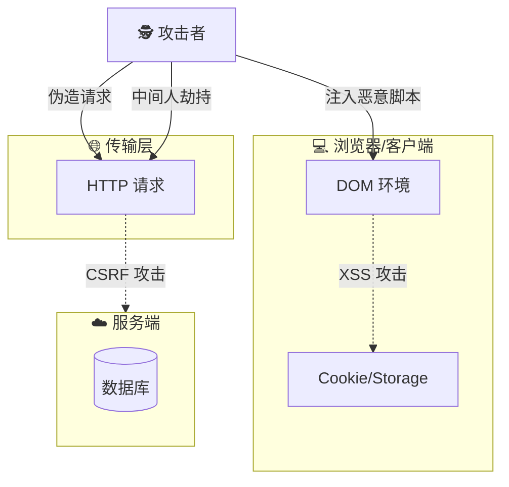

## 🛡️ 领域：Web 安全 (Web Security)

### 🎯 核心定义

> [!abstract] 信任的边界
> Web 安全的本质是**处理 " 不被信任 " 的输入**。
> 对于前端工程师而言，安全意味着守住**浏览器**这道大门，防止恶意代码在用户的客户端执行，并保护用户的敏感数据（Cookie/Token）不被窃取。
>
> *核心三要素 (CIA)*：**机密性** (Confidentiality)、**完整性** (Integrity)、**可用性** (Availability)。

---

### ⚔️ 威胁模型与攻击面 (Threat Model)

前端主要面临的威胁来源于攻击者利用浏览器的信任机制或解析漏洞：

#### 1. 客户端核心威胁 (The Big Two)

*前端工程师必须死磕的两个概念*

- **[[XSS]] (跨站脚本攻击)**：
	- *本质*：浏览器盲目信任并执行了恶意脚本。
	- *场景*：评论区注入 `<script>`、URL 参数反射。
	- *防御*：**转义输出**、**[[CSP]] (内容安全策略)**、避免 `v-html`/`dangerouslySetInnerHTML`。
- **[[CSRF]] (跨站请求伪造)**：
	- *本质*：利用用户的登录态（Cookie）偷偷发送请求。
	- *场景*：点开钓鱼链接，账户自动转账。
	- *防御*：**SameSite Cookie**、**CSRF Token**、验证 Referer。

#### 2. 其他常见威胁

- **[[点击劫持]] (点击劫持)**：利用 `iframe` 透明层覆盖，骗取用户点击。
- **[[中间人攻击]] (MITM)**：HTTP 明文传输被窃听或篡改（强制 HTTPS）。
- **依赖供应链攻击**：`npm` 包中包含恶意代码（需定期审计）。

---

### 🛡️ 纵深防御体系 (Defense Strategy)

不要指望单一手段解决所有问题，需要建立多层防御。

|**防御层级**|**关键技术/策略**|**前端动作 (Action)**|
|---|---|---|
|**编码层**|输入验证、输出转义|对所有用户输入进行 HTML Entity 编码；使用 React/Vue 自动转义|
|**浏览器层**|[[CSP]] (内容安全策略)|配置 HTTP Header，禁止加载外部未知脚本，禁止内联脚本|
|**传输层**|[[HTTPS]]|确保全站 HTTPS，开启 HSTS，避免混合内容 (Mixed Content)|
|**存储层**|Cookie 安全属性|敏感 Token 必须设置 `HttpOnly`、`Secure`、`SameSite=Strict`|
|**通信层**|[[CORS]]|理解跨域资源共享，不随意配置 `Access-Control-Allow-Origin: *`|
|**依赖层**|供应链审计|定期执行 `npm audit`，慎用不明来源的第三方 SDK|

---

### 📝 知识自检清单 (Checklist)

> [!hint] 面试/Code Review 速查
>
> Web 安全不是后端的专利，写出 " 不作死 " 的代码是前端的底线。

| **安全概念**         | **责任归属**    | **重要程度** | **关键考点/检查点**                                                  |
| ---------------- | ----------- | -------- | ------------------------------------------------------------- |
| [[XSS]]      | ✅ 前端主责  | ⭐⭐⭐⭐⭐    | 存储型 vs 反射型 vs DOM 型的区别？CSP 怎么配？                               |
| [[CSRF]]     | 🤝 协作防御 | ⭐⭐⭐⭐⭐    | SameSite 属性的作用？Token 放在 Header 还是 Body？                       |
| [[浏览器安全机制]]  | ✅ 必须理解  | ⭐⭐⭐⭐⭐    | [[同源策略]] (SOP) 是什么？CORS 预检请求 (Options) 什么时候触发？                |
| Token 存储     | ✅ 架构设计  | ⭐⭐⭐⭐     | JWT 存 LocalStorage 还是 Cookie？(推荐 Cookie + HttpOnly + CSRF 防范) |
| Clickjacking | ⚠️ 配置       | ⭐⭐⭐      | `X-Frame-Options` 响应头配置                                       |
| SQL 注入       | ❌ 后端主责      | ⭐⭐       | 前端虽然不修，但要懂原理（永远不要在前端拼装 SQL 语句）                                |
| 第三方依赖        | ✅ 日常维护  | ⭐⭐⭐      | 只有业务代码安全是不够的，`package.json` 里的包安全吗？                           |

---

### 📥 待办与进阶 (Inbox)

- [ ] **进阶研究**：[[SRI]] (子资源完整性) 如何防止 CDN 被劫持？
- [ ] **实战演练**：使用 PortSwigger (Burp Suite 官方靶场) 体验一次 XSS 攻击。
- [ ] **工具配置**：在项目中集成 `snyk` 或 `audit-ci` 进行自动化依赖扫描。

### 📚 权威资源

- **标准**：[[MDN Web Security]]
- **指南**：[[OWASP Top 10]] (Web 应用安全风险 Top 10)
- **工具**：[[Can I use]] (查询 CSP 等特性兼容性)
