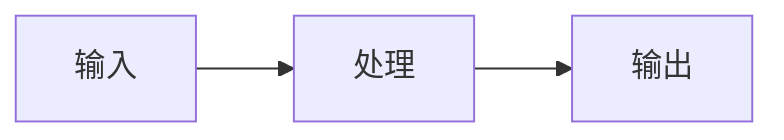

<!--
	概念笔记 (Concept Note) 设计原则：

	1. 概念笔记用于记录需要系统性理解的复杂主题
	2. 核心是"核心命题"——用陈述句表达你对概念的洞见
	3. 核心命题应该引用 atomic 笔记（陈述句观点），而非 term（术语定义）
	4. 知识图谱链接 term 和其他 concept，建立概念关系网络
	5. 包含运行机制的可视化（Mermaid 代码）
	6. FAQ 链接 Question，深化概念理解
	7. SOP 链接标准流程，建立「理解 → 实践」的桥梁

	写作节奏：
	- 先写核心定义（What）
	- 再写核心命题（Why/How）- 引用 atomic 观点
	- 最后写应用场景（When/Where）和 SOP（How to do）和FAQ（What's the problem）

	章节顺序：
	概念定义 → 核心命题 → 运行机制 → 关键区别 → 应用场景（包含SOP和FAQ） → 知识图谱 → 参考延伸
-->

## 概念：{{概念名称}}

> {{概念一句话定义}}

**解决的核心痛点**：{{该概念是为了解决什么具体问题而诞生的？}}

---

### 核心命题

> 核心命题引用 atomic 笔记（陈述句观点），每个命题是一句话洞见

- [[{{atomic笔记标题（陈述句观点）}}]]
	- **原理**：{{简述}}
- [[{{另一个atomic笔记标题}}]]
	- **原理**：{{简述}}

---

### 运行机制

{{描述机制，或插入 Mermaid 代码}}

---

### 关键区别

| 维度 | {{本概念}} | [[{{易混淆概念}}]] |
|:--- |:--- |:--- |
| **核心逻辑** | … | … |
| **适用场景** | … | … |

---

### 应用场景

- ✅ **适用场景**
	- **{{场景 1}}**：{{理由}}
- ⛔ **误用**
	- **{{反模式}}**：{{为什么这样用是错的}}

---

### SOP

> 与本概念相关的标准操作流程，通过实践辅助理解

- [[SOP-{{本概念相关示例}}]] — {{简短描述}}
- [[SOP-{{相关SOP名称}}]] — {{简短描述}}
- [[SOP-{{另一个SOP名称}}]] — {{简短描述}}

---

### FAQ

> 与本概念相关的开放性问题，待进一步探索

- [[Q-{{相关问题1}}]]
- [[Q-{{相关问题2}}]]

---

### 知识图谱

> 知识图谱链接 term（术语定义）和相关 concept，建立概念关系网络

- **父级概念**：[[{{上位概念}}]] — 新知识的概括性上位概念
- **子级概念**：
	- [[{{term或concept名称}}]] — 从属于本概念的下位知识
- **并列概念**：
	- [[{{并列概念}}]] — 同级别的相关概念
- **相关概念**：
	- [[{{相关概念}}]] — 有联系但非上下位的概念
- **参考文章**
	- {{文献/文章链接}}