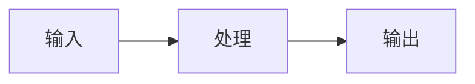

<!--
	概念笔记 (Concept Note) 设计原则：

	1. 概念笔记用于记录需要系统性理解的复杂主题
	2. 核心是"核心命题"——用陈述句表达你对概念的洞见
	3. 必须包含"关键区别"——与易混淆概念进行对比
	4. 包含运行机制的可视化（Mermaid 代码）
	5. 知识图谱部分建立概念间的联系

	写作节奏：
	- 先写核心定义（What）
	- 再写核心命题（Why/How）
	- 最后写应用场景（When/Where）
-->

## 概念：{{概念名称}}

> {{概念一句话定义}}

**解决的核心痛点**：{{该概念是为了解决什么具体问题而诞生的？}}

---

### 核心命题

- [[{{陈述句标题1，例如：虚拟DOM通过减少真实DOM操作提升性能}}]]
	- **原理**：{{简述}}
- [[{{陈述句标题2}}]]
	- **原理**：{{简述}}

---

### 运行机制

{{描述机制，或插入 Mermaid 代码}}

---

### 关键区别

| 维度 | {{本概念}} | [[{{易混淆概念}}]] |
|:--- |:--- |:--- |
| **核心逻辑** | … | … |
| **适用场景** | … | … |

---

### 应用场景

- ✅ **适用场景**
	- **{{场景 1}}**：{{理由}}
- ⛔ **误用**
	- **{{反模式}}**：{{为什么这样用是错的}}

---

### 知识图谱

> 知识图谱分类基于奥苏贝尔同化理论：上位（父级）、下位（子集）、并列、相关

- **父级概念**：[[{{上位概念}}]] — 新知识的概括性上位概念
- **子级概念**：[[{{子集概念1}}]] — 从属于本概念的下位知识
- **并列概念**：[[{{并列概念1}}]] — 同级别的相关概念
- **相关概念**：[[{{相关概念1}}]] — 有联系但非上下位的概念

---

### 参考延伸

- {{文献/文章链接}}
