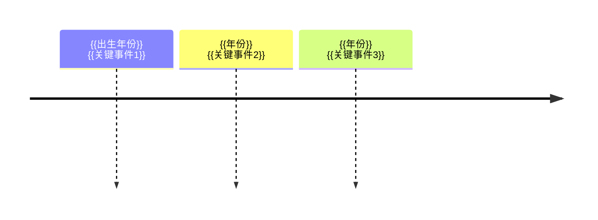

<!--
	人物笔记 (Person Note) 设计原则：

	1. 人物笔记用于记录对你有意义的人物——生平、成就、思想、关系网络
	2. 核心是"生平与思想"——客观生平 + 提炼的观点链接（链接 atomic/concept）
	3. 必须包含"主要成就"——人物的代表作和核心贡献
	4. 包含"关系网络"——师承、同侪、影响者/被影响者
	5. 与 Record 的区别：Record 记录事件，Person 记录人物

	命名规范：
	- aliases：R-{{人物姓名}}（与 record/roadmap 共享 R- 前缀）
	- birth/death：生卒年月（在世者 death 留空）
	- nationality：国籍/民族
	- occupation：职业/身份

	章节顺序：
	人物卡片 → 生平简介 → 人生时间线 → 主要成就 → 思想与观点 → 代表作品 → 关系网络 → 名言 → 评价与争议 → 知识图谱
-->

> {{人物一句话概述}}

## 人物卡片

| 项目 | 信息 |
|------|------|
| **姓名** | {{姓名}} |
| **生卒** | {{生卒年月}} |
| **国籍** | {{国籍}} |
| **职业** | {{职业/身份}} |
| **代表领域** | {{领域}} |

---

### 生平简介

{{人物生平概述，按时间分阶段叙述}}

---

### 人生时间线

| 时间 | 事件 | 影响 |
|------|------|------|
| {{年份}} | {{事件}} | {{影响}} |

---

### 主要成就

- **{{成就1}}**：{{内容与影响}}
- **{{成就2}}**：{{内容与影响}}

---

### 思想与观点

> 提炼人物的核心思想，链接到相关 atomic/concept 笔记

- [[{{思想观点1}}]] — {{简述}}
- [[{{思想观点2}}]] — {{简述}}

---

### 代表作品

- **{{作品1}}**（{{年份}}）：{{简介}}
- **{{作品2}}**（{{年份}}）：{{简介}}

---

### 关系网络

- **师承**：[[{{老师}}]] — {{关系说明}}
- **同侪**：[[{{同侪}}]] — {{关系说明}}
- **影响者**：[[{{影响过TA的人}}]] — {{关系说明}}
- **被影响者**：[[{{受TA影响的人}}]] — {{关系说明}}

---

### 名言

> {{名言1}} —— {{出处/年份}}
>
> {{名言2}} —— {{出处/年份}}

---

### 评价与争议

- **正面评价**：{{评价}}
- **争议**：{{争议点}}

---

### 知识图谱

- **父级领域**：[[{{所属领域}}]]
- **相关概念**：
	- [[{{概念A}}]] — {{关联说明}}
- **相关人物**：
	- [[{{人物A}}]] — {{关联说明}}
- **参考来源**
	- {{文献/文章链接}}
