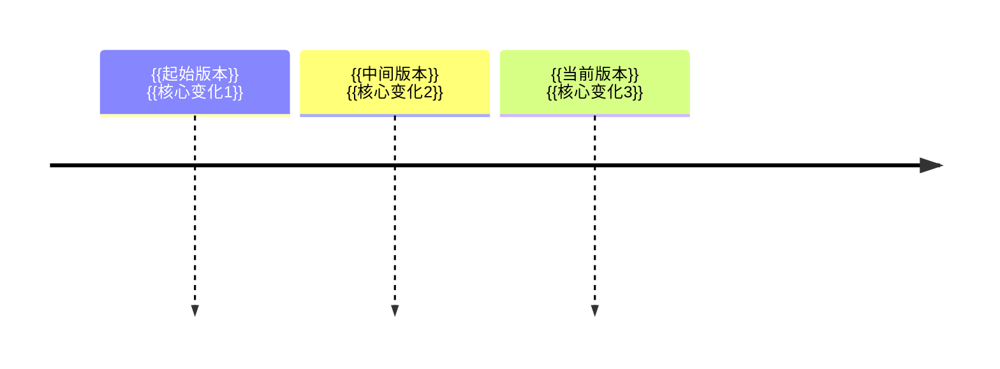

<!--
	路线图笔记 (Roadmap Note) 设计原则：

	1. 用于记录线性演进历程：版本迭代、技术发展、时间线等
	2. 核心是"演进阶段"——按时间/版本顺序记录关键变化
	3. 每个阶段包含：版本号/时间点、核心变化、解决的关键问题
	4. 包含可视化时间线（Mermaid timeline 或 gantt）
	5. 关联概念链接——每个阶段涉及的相关概念

	章节顺序：
	定义 → 演进概览 → 阶段详情 → 时间线 → 关键转折点 → 未来展望 → 关联概念
-->

## {{主题}}演进

> {{一句话概括演进历程的核心}}

**时间跨度**：{{起始版本/时间}} → {{当前版本/时间}}
**演进动力**：{{驱动演进的根本原因}}

---

### 演进概览

---

### 阶段详情

#### {{版本A/阶段A}}

- **时间**：{{版本发布时间或阶段时间}}
- **核心变化**：{{主要更新内容}}
- **解决的关键问题**：{{这个版本解决了什么问题}}
- **相关概念**：[[{{相关概念A}}]] [[{{相关概念B}}]]

#### {{版本B/阶段B}}

- **时间**：{{版本发布时间或阶段时间}}
- **核心变化**：{{主要更新内容}}
- **解决的关键问题**：{{这个版本解决了什么问题}}
- **相关概念**：[[{{相关概念A}}]] [[{{相关概念B}}]]

#### {{版本C/阶段C}}

- **时间**：{{版本发布时间或阶段时间}}
- **核心变化**：{{主要更新内容}}
- **解决的关键问题**：{{这个版本解决了什么问题}}
- **相关概念**：[[{{相关概念A}}]] [[{{相关概念B}}]]

---

### 关键转折点

> 演进中的重要里程碑或范式转换

| 时间点 | 转折内容 | 影响 |
|:---|:---|:---|
| {{版本/时间}} | {{转折事件}} | {{带来的变化}} |

---

### 未来展望

- **趋势**：{{未来可能的方向}}
- **待解决**：{{仍有待解决的问题}}
- **值得关注**：{{值得跟踪的新方向}}

---

### 关联概念

- **父级领域**：[[{{父级领域}}]]
- **相关概念**：
	- [[{{概念A}}]] — {{关联说明}}
	- [[{{概念B}}]] — {{关联说明}}