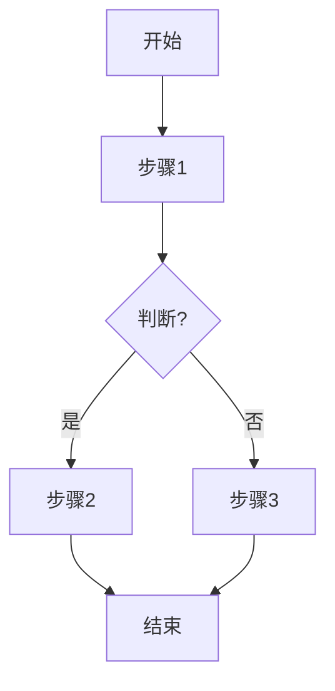

## SOP：{{动宾结构标题}}

> 一句话描述这个 SOP 的目标和适用场景

---

### 适用场景

- 场景1：{{具体情况}}
- 场景2：{{具体情况}}

---

### 流程图解

---

### 核心步骤

1. **步骤1**：{{做什么}}
   - 注意：{{关键点}}
2. **步骤2**：{{做什么}}
3. **步骤3**：{{做什么}}

---

### 常见坑点

- ⛔ **反模式**：{{不要做什么}}
- 🔧 **排查**：如果 {{错误}}，检查 {{检查点}}

---

### 知识图谱

- **父级概念**：[[{{父级}}]]
- **关联概念**：[[{{相关笔记}}]]