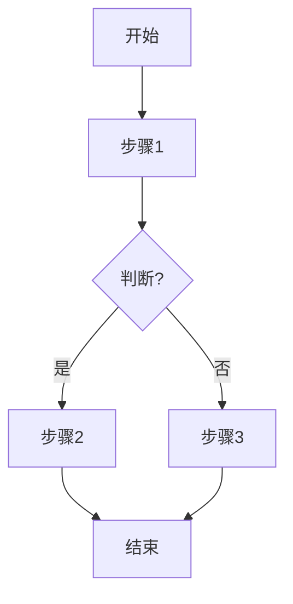

<!--
	SOP 设计原则：

	1. SOP指的是Standard Operating Procedure（标准化作业流程）
	2. 核心是标准化（目标、实现步骤、实践示例）、边界条件（适用场景、常见坑点）
	3. 撰写流程：先确定目标和适用场景，然后写实现步骤并画流程图，最后总结坑点

	视觉化支持：
	- Mermaid图标：流程图形式，展示达到目标的标准流程
-->

## SOP：{{动宾结构标题}}

> 一句话描述这个 SOP 的目标和适用场景

目标：{{要实现的目标}}
实现：{{实践示例}}

> **问题溯源**：本 SOP 是 [[Q-{{源问题}}]] 的收敛成果——经过多方案对比和实践验证，固化为标准流程。

---

### 适用场景

- 场景 1：{{具体情况}}
- 场景 2：{{具体情况}}

---

### 流程图解

---

### 核心步骤

1. **步骤 1**：{{做什么}}
	 - 注意：{{关键点}}
2. **步骤 2**：{{做什么}}
3. **步骤 3**：{{做什么}}

---

### 实践/示例

{{实践或者代码示例}}

### 常见坑点

- ⛔ **反模式**：{{不要做什么}}
- 🔧 **排查**：如果 {{错误}}，检查 {{检查点}}

---

### 知识图谱

- **相关概念**：
	- [[{{相关笔记}}]]
	- [[{{相关笔记}}]]
- **问题来源**：
	- [[Q-{{源问题}}]] — 此 SOP 解决的问题来源