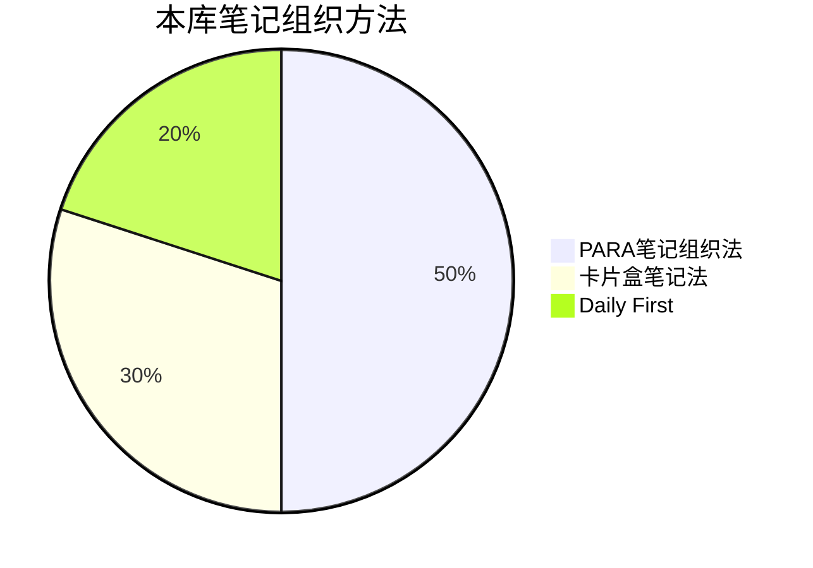

**user**: 本库采用 PARA 笔记组织法 + 卡片盒笔记法 +Daily First 方案来组织笔记，
优化本笔记 [[本库组织方案]]
[Timestamp: 2025/05/04 17:33:18]

**ai**: 好的，我将按照 PARA 笔记组织法和卡片盒笔记法的原则，对你的笔记 [[本库组织方案]] 进行优化，并提供详细的改进建议。

**优化分析**

这份笔记是对你个人知识库组织方案的概述，结合了 PARA、卡片盒笔记法和 Daily Note First 三种方法。目前结构清晰，但元数据和内容结构可以进一步优化，以提高检索效率和知识连接性。

**优化后的笔记**

```markdown
---
title: "Obsidian 知识库组织方案：PARA + 卡片盒笔记法 + Daily First"
para: "2-领域"
zettel: "00-元笔记"
tags:
  - "知识管理/知识组织"
  - "Obsidian/工作流"
  - "方法论/笔记系统"
keywords:
  - "PARA"
  - "卡片盒笔记法"
  - "Daily Note"
description: "本笔记概述了个人 Obsidian 知识库的组织方案，结合 PARA 笔记组织法、卡片盒笔记法和 Daily Note First 策略，旨在构建高效的知识管理系统。"
related:
  - "[[PARA笔记组织法]]"
  - "[[Zettelkasten (卡片盒笔记法)|卡片盒笔记法]]"
  - "[[Daily Note]]"
---

## 前言



本库采用 [[PARA笔记组织法]] + [[Zettelkasten (卡片盒笔记法)|卡片盒笔记法]] + Daily Note First

- 方法论参见：[[知识组织概述]]
- 工作流参见：[[PARA实施工作流]]
- 疑难问题参见：[[Q1：按照 PARA 笔记组织法，我创建了以下的笔记结构，这种结构不冗余吗？应该怎样优化？]]

## 一、文件系统

[[文件结构设计]]

## 二、符号系统

```bash

**实施建议**

1.  **结构改进**：
    *   **PARA 分类**：将 PARA 分类从 `00-META` 调整为 `2-领域` 更合适，因为该笔记描述的是一个知识管理领域的方法论，而非具体的项目或资源。
    *   **标题优化**：更具体的标题能提高检索效率，建议增加 "Obsidian" 和 "Daily First" 等关键词。
    *   **摘要优化**：添加更详细的描述，突出笔记的核心价值和解决的问题。
2.  **知识连接**：
    *   **相关概念**：在元数据中添加 [[Daily Note]] 的链接，完善知识网络。
    *   **卡片盒分类**：将 `zettel` 设置为 `00-元笔记`，表明这是一个描述笔记系统本身的元笔记。
3.  **后续行动**：
    *   定期回顾和更新此笔记，确保其与你的实际使用情况保持一致。
    *   考虑将 "符号系统" 部分展开，详细描述你使用的符号和命名规范。

希望这些建议能帮助你更好地组织和管理你的 Obsidian 知识库！

[Timestamp: 2025/05/04 17:33:24]

**user**: 有哪些思维方式？其对应的工具是什么？
[Timestamp: 2025/05/04 17:40:35]

**ai**: 思维方式有很多种，每种思维方式都有其独特的应用场景和适合的工具。以下是一些常见的思维方式及其对应的工具：

1.  **结构化思维**：
    *   **描述**：将问题或信息分解为更小的、易于管理的部分，并理清它们之间的关系。
    *   **工具**：
        *   **思维导图**：XMind, MindManager, FreeMind
        *   **流程图**：draw.io, Visio
        *   **大纲工具**：Obsidian, Roam Research, Dynalist
2.  **批判性思维**：
    *   **描述**：对信息进行评估和分析，识别偏见、假设和逻辑谬误。
    *   **工具**：
        *   **论证图**：Rationale, Araucaria
        *   **笔记工具**：Obsidian, Evernote (用于记录和分析信息)
3.  **系统性思维**：
    *   **描述**：将问题视为一个复杂的系统，考虑各个组成部分之间的相互作用和反馈循环。
    *   **工具**：
        *   **系统动力学建模软件**：Vensim, Stella
        *   **因果循环图**：Causal Loop Diagram (可以用 draw.io 或 Visio 绘制)
4.  **设计思维**：
    *   **描述**：以人为本，通过共情、定义问题、头脑风暴、原型设计和测试来解决问题。
    *   **工具**：
        *   **白板工具**：Miro, Mural
        *   **原型设计工具**：Figma, Adobe XD
5.  **创新思维**：
    *   **描述**：产生新的想法和解决方案，打破常规思维模式。
    *   **工具**：
        *   **头脑风暴工具**：MindMeister, Stormboard
        *   **随机想法生成器**：用于激发灵感
6.  **视觉化思维**：
    *   **描述**：使用图像、图表和图形来理解和表达信息。
    *   **工具**：
        *   **Excalidraw**: 用于绘制草图和图表
        *   **Canva**: 用于创建信息图和演示文稿
        *   **数据可视化工具**：Tableau, Power BI

关于你提供的 Excalidraw 文件 [[draw_visual_thinking.excalidraw]]，它本身就是一个视觉化思维的工具，可以用来绘制各种图表和图形，帮助你更好地理解和表达信息。你可以使用它来实践上述的各种思维方式，例如绘制思维导图、流程图、因果循环图等。

[Timestamp: 2025/05/04 17:40:41]

**user**: 我认为视觉思维应该归属于知识内化领域，你觉得呢
[Timestamp: 2025/05/04 17:47:57]

**ai**: 我理解你的观点。将视觉思维归属于知识内化领域是有道理的。

**优化分析**

视觉思维作为一种认知方式，确实在知识内化过程中扮演着重要角色。通过将抽象概念转化为图像、图表等视觉形式，可以帮助我们更好地理解、记忆和应用知识。

**优化后的笔记**

```markdown
---
title: "知识内化概述：从理解到应用"
para: "2-领域"
zettel: "01-核心概念"
tags:
  - "知识管理/知识内化"
  - "学习方法/认知心理学"
  - "思维方式/视觉思维"
keywords:
  - "知识内化"
  - "费曼技巧"
  - "渐进式总结"
  - "间隔重复"
  - "视觉思维"
description: "概述知识内化的概念、过程、方法和重要性，强调视觉思维在知识内化中的作用，为深入学习和实践知识内化奠定基础。"
related:
  - "[[费曼技巧]]"
  - "[[渐进式总结]]"
  - "[[间隔重复]]"
  - "[[视觉思维]]"
---

## 什么是知识内化？

知识内化是指将外部获取的知识（信息、概念、技能等）经过理解、吸收、整合和应用，最终转化为个人认知结构和能力的过程。它不仅仅是记忆，更重要的是理解和运用。

**视觉思维在知识内化中的作用**

视觉思维是一种重要的认知方式，通过将抽象概念转化为图像、图表等视觉形式，可以帮助我们：

- **更好地理解知识**：视觉化可以简化复杂信息，使其更易于理解。
- **更牢固地记忆知识**：图像比文字更容易被大脑记住。
- **更灵活地应用知识**：视觉化可以帮助我们发现知识之间的联系，从而更好地应用知识解决实际问题。

## 知识内化的目标

- **理解**：深入理解知识的本质和原理。
- **记忆**：将知识牢固地储存在记忆中。
- **应用**：能够灵活地运用知识解决实际问题。
- **创新**：在已有知识的基础上进行创新和创造。

## 知识内化的过程

1. **获取知识**：通过阅读、学习、观察等方式获取外部知识。
2. **理解知识**：深入理解知识的含义、原理和应用场景。（**利用视觉化工具辅助理解**）
3. **关联知识**：将新知识与已有的知识体系进行关联，建立知识网络。（**绘制思维导图或知识图谱**）
4. **实践知识**：通过实践应用知识，加深理解和记忆。（**将实践过程可视化**）
5. **反思知识**：对知识进行反思和总结，提炼核心要点。（**使用视觉化工具进行总结**）

## 常用的知识内化方法

- **[[费曼技巧]]**：通过用自己的话解释知识，检验理解程度。（**可以使用图表或图像进行解释**）
- **[[渐进式总结]]**：通过逐步提炼和总结笔记，加深对知识的理解。（**可以使用视觉化工具进行总结**）
- **[[间隔重复]]**：通过间隔一段时间重复学习，巩固记忆。（**可以使用知识卡片，并配以图像**）
- **主动回忆**：通过主动回忆知识，锻炼记忆和理解能力。（**可以使用视觉化提示**）
- **知识卡片**：通过制作知识卡片，方便记忆和复习。（**在卡片上添加图像或图表**）

## 知识内化的重要性

- **提升个人能力**：知识内化是将知识转化为个人能力的关键步骤。
- **解决实际问题**：只有内化后的知识才能真正用于解决实际问题。
- **促进个人成长**：知识内化是个人成长和持续学习的基础。
- **提高知识管理效率**：内化后的知识更容易被检索和应用，提高知识管理效率。

## 总结

知识内化是一个持续学习和实践的过程，通过掌握正确的知识内化方法，并充分利用视觉思维，我们可以将外部知识转化为个人能力，从而提升个人价值和解决问题的能力。
```

**实施建议**

1. **内容补充**：
		- 在 " 什么是知识内化？" 部分增加对视觉思维的描述，强调其在知识内化中的作用。
		- 在 " 知识内化的过程 " 部分，说明如何在每个步骤中利用视觉化工具辅助知识内化。
		- 在 " 常用的知识内化方法 " 部分，说明如何将视觉化方法融入到各种知识内化技巧中。
2. **元数据优化**：
		- 在 `tags` 中增加 " 思维方式/视觉思维 "，更准确地描述笔记的主题。
		- 在 `keywords` 中增加 " 视觉思维 "，提高检索效率。
		- 在 `related` 中增加 "[[视觉思维概述]]"（如果你的知识库中有关于视觉思维的笔记）。
3. **知识连接**：
		- 创建一篇关于 [[视觉思维概述]] 的笔记，详细介绍视觉思维的概念、方法和工具。
		- 在其他与知识内化相关的笔记中，添加指向 [[知识内化概述]] 的链接。

通过以上优化，可以更清晰地表达视觉思维在知识内化中的重要性，并与其他相关概念建立更紧密的联系。

[Timestamp: 2025/05/04 17:48:06]

**user**: 根据概述 - 方法论 - 工作流的层级优化 [[视觉思维概述]]
[Timestamp: 2025/05/04 17:50:12]

**ai**: 好的，我将根据概述 - 方法论 - 工作流的层级，对你的笔记 [[视觉思维概述]] 进行优化。

**优化分析**

这份笔记对视觉思维进行了全面的概述，包括概念、类型、工具和应用场景。但目前内容结构较为松散，缺乏清晰的层级关系。通过将内容组织成 " 概述 - 方法论 - 工作流 " 的结构，可以提高笔记的逻辑性和可读性。

**优化后的笔记**

```markdown
---
title: "视觉思维：概念、工具与应用"
para: "2-领域"
zettel: "01-核心概念"
tags:
  - "知识管理/视觉思维"
  - "思维方法/认知科学"
  - "视觉化/工具"
keywords:
  - "视觉思维"
  - "思维导图"
  - "流程图"
  - "信息图"
description: "本笔记旨在介绍视觉思维的概念、类型、工具和应用，帮助你更好地利用视觉元素提升认知效率。内容涵盖视觉思维的定义、常用工具、应用场景以及实践工作流。"
related:
  - "[[视觉思维工作流]]"
---

## 1. 概述

### 1.1 什么是视觉思维？

人类大脑通过双通道 —— " 语言 " 和 " 视觉 " 处理信息，当两者结合时，记忆和理解效率能够显著提高。视觉思维是指利用视觉元素（如图表、图像、图形等）来思考、学习和解决问题的思维方式。

### 1.2 为什么需要视觉思维？

面对不同的场景下的不同认知目标，选择合适的思维模式和匹配的视觉工具能够极大地提升理解能力、降低认知负荷。

举个例子，如果我们想设计一个智能水杯，这个场景下合适的思维模式是==发散思维==，匹配的视觉工具是==思维导图==。

```bash
场景：新产品创意头脑风暴
认知目标：快速生成非结构化创意，激发团队联想
匹配思维：发散思维
匹配工具：思维导图
示例：
	- 中心节点写产品名称（智能水杯），分支延申关键词如：用户痛点、技术方案、竞品分析等
	- 使用颜色区分类别（如红色表示技术，绿色表示市场），使用图表区分优先级等
Gestalt原则：
	- 接近性：相关点子放在相邻分支
	- 相似性：同类功能使用相同颜色
```

![[56cbaa4dfff0adb486d7a1e8626768d2_MD5.jpeg|Open: Pasted image 20250424002635.png]]

## 2. 方法论

### 2.1 视觉思维的类型与工具

| 思维类型  | 常用工具            | 应用场景             | 认知目标                      |
| ----- | --------------- | ---------------- | ------------------------- |
| 线性思维  | 流程图、时间线、甘特图     | 流程优化、项目管理、任务分解   | 理清流程步骤、规划时间安排、跟踪任务进度      |
| 发散思维  | 思维导图、头脑风暴、自由写作  | 创意生成、问题探索、知识关联   | 快速生成创意、激发联想、发现新的可能性       |
| 系统思维  | 因果循环图、系统动力学模型   | 复杂系统分析、问题诊断、决策制定 | 理解系统结构、识别关键因素、预测系统行为      |
| 批判性思维 | 论证图、概念图、SWOT 分析 | 信息评估、决策分析、问题解决   | 评估信息可靠性、识别逻辑谬误、做出明智决策     |
| 空间思维  | 建模、3D 可视化、地图    | 建筑设计、城市规划、产品设计   | 理解空间关系、可视化设计方案、优化空间布局     |
| 隐喻思维  | 信息图、视觉隐喻、故事板    | 沟通表达、知识传递、品牌营销   | 简化复杂概念、增强记忆效果、激发情感共鸣      |
| 设计思维  | 用户旅程图、原型设计、用户测试 | 产品设计、服务创新、用户体验优化 | 深入理解用户需求、快速迭代设计方案、提升用户满意度 |
| 计算思维  | 算法流程图、数据可视化、模拟  | 数据分析、问题建模、自动化    | 理解计算过程、可视化数据模式、优化算法效率     |

### 2.2 视觉工具选取原则

![[视觉工具选取原则]]

## 3. 工作流

👉[[视觉思维工作流]]

### 3.1 学习资源

- [Excalidraw教程](https://www.youtube.com/watch?v=QKnQgSjJVuc)

```bash

**实施建议**

1.  **结构调整**：
    *   将笔记内容划分为 "概述"、"方法论" 和 "工作流" 三个主要部分，形成清晰的层级结构。
    *   在 "概述" 部分，明确定义视觉思维的概念和重要性。
    *   将 "思维类型、工具与应用场景" 表格移至 "方法论" 部分，作为视觉思维工具选择的指导。
    *   将 "视觉工具选取原则" 图片移至 "方法论" 部分，作为选择工具的参考依据。
    *   在 "工作流" 部分，提供指向 [[视觉思维工作流]] 笔记的链接，并补充学习资源。
2.  **内容优化**：
    *   在 "概述" 部分，可以增加一些关于视觉思维的认知科学原理，例如双重编码理论。
    *   在 "方法论" 部分，可以对每种思维类型和工具进行更详细的解释，并提供实际案例。
3.  **元数据优化**：
    *   在 `tags` 中增加 "认知科学"，更准确地描述笔记的主题。
    *   在 `description` 中，突出 "概述-方法论-工作流" 的结构。

通过以上优化，可以使笔记结构更清晰、内容更充实，并与其他相关笔记建立更紧密的联系。

[Timestamp: 2025/05/04 17:50:21]
